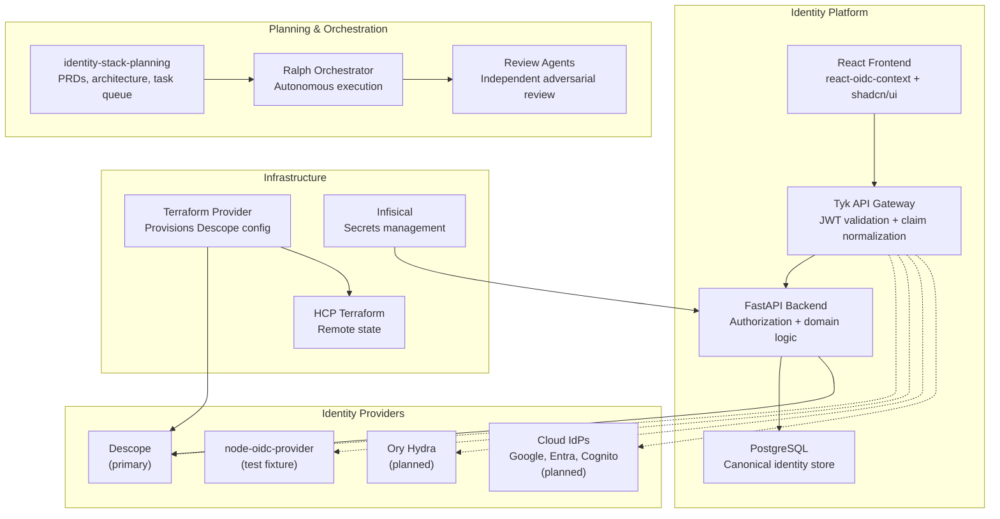
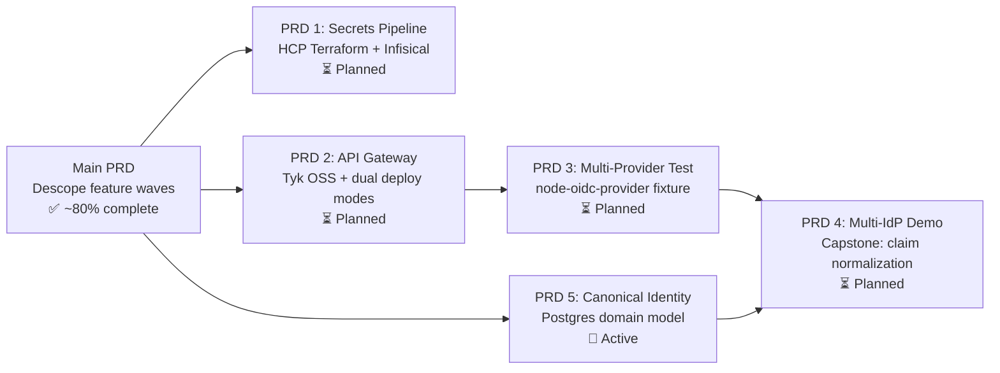
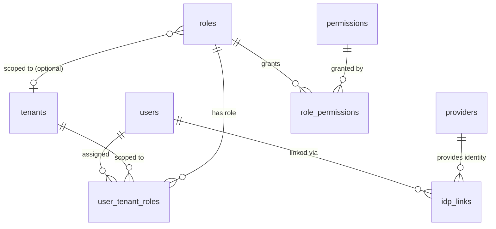
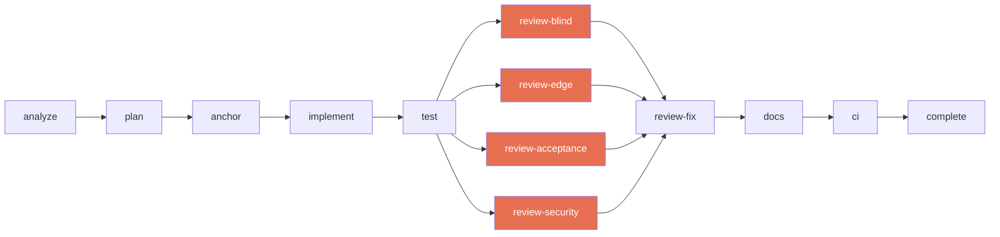

# identity-stack-planning

Planning and orchestration hub for a multi-repo identity platform. This repo contains zero application code — only the planning artifacts, architecture decisions, task tracking, and autonomous execution prompts that drive development across three sibling repositories.

The workspace is also a case study in **agentic software development**: AI agents plan the work (BMAD-METHOD), execute it autonomously (Ralph Orchestrator), and review it adversarially with independent agents that have zero access to the implementation context.

## The Vision

Build a provider-independent identity platform where swapping or adding an identity provider means implementing one adapter — not rewriting the application. The platform starts with Descope, proves the abstraction with a second provider, and delivers a capstone multi-IdP demo.



## The Repositories

### py-identity-model

Production OIDC/OAuth2.0 Python library with dual sync/async APIs. The token validation foundation for the entire platform.

| Category | Coverage |
|----------|----------|
| Core | Discovery (RFC 8414), JWKS (RFC 7517), JWT Validation (RFC 7519) |
| Auth Flows | Auth Code + PKCE (RFC 7636), Device Authorization (RFC 8628), Refresh (RFC 6749 §6) |
| Token Management | Introspection (RFC 7662), Revocation (RFC 7009), Token Exchange (RFC 8693) |
| Security | DPoP (RFC 9449), FAPI 2.0 Security Profile |
| Advanced Requests | PAR (RFC 9126), JAR (RFC 9101) |

**Status:** v2.17.1 published. All 16 protocol features shipped. 100+ merged PRs. Integration test harness deployed (node-oidc-provider). Review fix cycle complete (16 PRs re-reviewed and fixed).

**Repo:** [jamescrowley321/py-identity-model](https://github.com/jamescrowley321/py-identity-model)

### terraform-provider-descope

Terraform provider for Descope (Go). Fork of `descope/terraform-provider-descope` extended with additional resources.

| Resource | Description |
|----------|-------------|
| `descope_project` | Project configuration |
| `descope_permission` | Permission definitions |
| `descope_role` | Role definitions with permission assignments |
| `descope_tenant` | Tenant/organization configuration |
| `descope_access_key` | Machine-to-machine access keys |
| `descope_sso` | SSO/federation configuration |
| `descope_fga_schema` / `descope_fga_relation` | Fine-grained authorization |
| `descope_password_settings` | Password policy configuration |
| `descope_outbound_application` | Outbound OAuth application |
| `descope_third_party_application` | Third-party application registration |
| `descope_list` | IP/text allow/deny lists |
| `descope_project_export` (data source) | Project configuration export |

**Status:** Published to Terraform Registry (v1.1.x). 15 resources, 4 data sources. 65+ merged PRs. All review fix cycles complete.

**Repo:** [jamescrowley321/terraform-provider-descope](https://github.com/jamescrowley321/terraform-provider-descope)

### identity-stack

Full-stack SaaS starter with FastAPI backend, Vite/React frontend, and Terraform infrastructure.

| Feature | Description |
|---------|-------------|
| Session Management | OAuth2 code flow via Descope hosted login, token refresh |
| Tenant Management | Multi-tenant context switching, tenant CRUD |
| RBAC | Role and permission assignment, `require_role()` / `require_permission()` dependencies |
| Fine-Grained Authorization | ReBAC with Descope FGA, document-level access control |
| Admin Portal | User management, role assignment, tenant administration |
| Social Login | Google, GitHub authentication |
| Passkeys | WebAuthn/FIDO2 passwordless authentication |
| Security Hardening | CSP/HSTS/X-Frame headers, rate limiting, structured logging, audit logging |
| Health Checks | Descope API and database connectivity monitoring with retry logic |
| UI Framework | shadcn/ui + Tailwind CSS v4, dark mode, responsive sidebar layout |

**Status:** Core platform operational. 44+ merged PRs. All security hardening complete. UI migrated to shadcn/ui. Ready for PRD 5 (canonical identity domain model).

**Repo:** [jamescrowley321/identity-stack](https://github.com/jamescrowley321/identity-stack)

## The Roadmap

Six PRDs define the platform evolution. See [docs/roadmap.md](docs/roadmap.md) for full details, sequencing, and cross-PRD dependencies.



**Current focus:**
- **PRD 5** — Canonical identity domain model: Postgres-backed source of truth with 8 SCIM-aligned tables, write-through sync to Descope, webhook inbound sync, multi-IdP identity linking. 4 epics, 19 stories. [Ralph loop ready](docs/ralph-loop-process.md).
- **Main PRD** — py-identity-model integration tests against live OIDC provider (node-oidc-provider).

**Next:**
- **PRD 1** — Reduce N scattered `.env` secrets to 2 bootstrap credentials via Infisical + HCP Terraform
- **PRD 2** — Tyk API gateway with dual deployment modes (standalone vs gateway), offloading JWT validation and rate limiting

**Capstone:**
- **PRD 4** — User authenticates with Descope, Ory, or a cloud IdP. Tyk normalizes divergent claims. Backend operates on canonical identity without knowing the provider.

## Architecture

See [docs/system-architecture.md](docs/system-architecture.md) for the full technical overview with C4 diagrams, ER models, request lifecycle, deployment topologies, and consolidated ADR index.

### Provider Abstraction Tiers

Capabilities are classified by cross-provider mapping feasibility (see ADR-3):

```
+------------------------------------------------------------------+
|                     Tier 1: Abstract                              |
|  (similar shape across providers — common interface)              |
|                                                                   |
|   User CRUD    ReBAC/Authz    SSO/Federation    Session Mgmt     |
|   M2M Keys     Token Validation                                  |
+------------------------------------------------------------------+
|                     Tier 2: Translate                             |
|  (interface + provider-specific adapters)                         |
|                                                                   |
|   RBAC Roles/Permissions         Password Policy                 |
+------------------------------------------------------------------+
|                     Tier 3: Provider-Specific                     |
|  (don't abstract — too divergent)                                |
|                                                                   |
|   Multi-Tenancy    Flows/Orchestration    Connectors    JWTs     |
+------------------------------------------------------------------+
```

### Canonical Identity Domain Model

The architectural foundation for provider independence (PRD 5). Inverts the current architecture: the backend owns a canonical Postgres store, with identity providers becoming sync targets.



**Write-through sync:** Postgres write first → sync to IdP second → sync failures logged, never rolled back → reconciliation catches up asynchronously.

### Data Flow

```
terraform-provider-descope            py-identity-model
  (provisions Descope infra)            (validates tokens at runtime)
         |                                       |
         |  roles, permissions,                  |  OIDC discovery, JWKS,
         |  tenants, SSO, keys                   |  JWT decode & validate
         v                                       v
                    identity-stack
         +--------------------------------------------+
         |  React frontend    |  FastAPI backend       |
         |  react-oidc-context |  IdentityService      |
         |  OAuth2 code flow  |  → PostgreSQL          |
         |  Descope hosted    |  → DescopeSyncAdapter  |
         |  login             |  → py-identity-model   |
         +--------------------------------------------+
```

## Agentic Development

Three layers of AI-driven tooling plan, implement, and review code autonomously. See [ralph loop process](docs/ralph-loop-process.md) and [review process](docs/review-process.md) for full details.

### Layer 1: BMAD-METHOD (Planning)

[BMAD-METHOD](https://github.com/bmad-code-org/BMAD-METHOD) v6 provides structured planning with 9 specialized agent personas:

| Persona | Agent | Role |
|---------|-------|------|
| Winston | Architect | System design, API architecture, ADRs |
| Amelia | Developer | Story execution, TDD, code implementation |
| John | Product Manager | PRDs, requirements, stakeholder alignment |
| Mary | Business Analyst | Market research, competitive analysis |
| Quinn | QA Engineer | Test automation, E2E testing, coverage |
| Bob | Scrum Master | Sprint planning, agile ceremonies |
| Sally | UX Designer | User research, interaction design |
| Paige | Tech Writer | Documentation, standards compliance |
| Barry | Quick Flow Solo Dev | Rapid spec-to-implementation |

Each persona has an activation protocol, interactive menu, and Claude Code skill integration. Available as `/bmad-*` commands.

### Layer 2: Ralph Orchestrator (Execution)

[Ralph Orchestrator](https://github.com/mikeyobrien/ralph-orchestrator) drives autonomous task execution. A single task queue tracks cross-repo dependencies. Ralph loops execute one phase per iteration:



**Key properties:**
- One phase per iteration with state persisted to disk (crash-recoverable)
- Story loops use git worktrees for filesystem isolation (parallel execution)
- 147+ tasks tracked across 3 repos with cross-repo dependencies
- See [docs/ralph-loop-process.md](docs/ralph-loop-process.md)

### Layer 3: Independent Review Agents (Quality)

Each reviewer runs in a completely fresh context with zero access to the implementation:

| Agent | What It Catches | Trigger |
|-------|----------------|---------|
| **Blind Hunter** | Logic errors, security holes, dead code, resource leaks | Every PR (diff only) |
| **Edge Case Hunter** | Unhandled branches, boundary conditions, async gaps | Every PR (diff + repo) |
| **Acceptance Auditor** | Missing implementations, spec drift, scope creep | Every PR (spec + repo) |
| **Sentinel** | Tenant isolation, auth bypass, injection, JWT attacks | Every PR (security lens) |
| **Viper** | Exploitation paths, privilege escalation, CVSS scoring | Auth/middleware changes only |

Blocking findings must be resolved before the PR can be created. Maximum 3 fix iterations; unresolved findings block the PR for manual intervention. See [docs/review-process.md](docs/review-process.md).

## Project Status

| Repo | Done | In Progress | Pending | Blocked | Merged PRs |
|------|------|-------------|---------|---------|------------|
| terraform-provider-descope | 18 | 0 | 0 | 1 | 65+ |
| identity-stack | 23 | 0 | 7 | 6 | 44+ |
| py-identity-model | 47 | 2 | 16 | 0 | 100+ |

**Blockers:**
- `T6` (terraform-provider-descope): SSO application resource requires Descope enterprise license
- identity-stack blocked tasks depend on T6 or intentionally wontfix'd resources

Full task breakdown: [`task-queue.md`](_bmad-output/implementation-artifacts/task-queue.md)

## Quick Start

BMAD skills are available as `/bmad-*` commands in Claude Code:

```
/bmad-help                      # Contextual guidance on what to do next
/bmad-pm                        # Product Manager agent
/bmad-architect                 # Architect agent
/bmad-create-prd                # Create a Product Requirements Document
/bmad-create-architecture       # Design system architecture
/bmad-create-epics-and-stories  # Break down work into stories
/bmad-sprint-planning           # Generate sprint plan
/bmad-code-review               # Multi-layer adversarial code review
/ralph-status                   # Monitor active ralph loops across workspace
```

Running a ralph loop:

```bash
cd ~/repos/auth/identity-stack
cp ~/repos/auth/identity-stack-planning/_bmad-output/implementation-artifacts/ralph-prompts/canonical-identity.md PROMPT.md
ralph run

# Monitor
cat .claude/task-state.md
```

## Documentation

Start with the [roadmap](docs/roadmap.md), then explore by topic:

| Document | Description |
|----------|-------------|
| **[Roadmap](docs/roadmap.md)** | PRD sequencing, dependencies, and implementation phases |
| **[System Architecture](docs/system-architecture.md)** | C4 diagrams, ER models, request lifecycle, ADR index |
| **[Ralph Loop Process](docs/ralph-loop-process.md)** | How autonomous execution works end-to-end |
| **[Review Process](docs/review-process.md)** | Independent review agents and quality gates |
| **[Glossary](docs/glossary.md)** | Definitions for all terms used across planning docs |
| [Descope Data Model](docs/descope-data-model.md) | OAuth 2.0/OIDC endpoint mapping, JWT claims, tenant model |
| [OIDC Certification](docs/oidc-certification-analysis.md) | OpenID Foundation certification readiness for py-identity-model |
| [Orchestrator Comparison](docs/ralph-planning/orchestrator-comparison.md) | Chief Wiggum vs Ralph Orchestrator analysis |
| [BMAD Integration Plan](docs/ralph-planning/ralph-bmad-integration-plan.md) | Security agents, skills, and Ralph hat topology |

## Repository Structure

```
identity-stack-planning/
  _bmad/                          # BMAD-METHOD v6 installation
    bmm/                          # Agents, workflows, config
  _bmad-output/
    planning-artifacts/           # PRDs, architecture docs, epics
      prd.md                      # Main PRD — unified platform vision
      prd-canonical-identity.md   # PRD 5 — canonical identity domain model
      prd-api-gateway.md          # PRD 2 — Tyk API gateway
      prd-infrastructure-secrets.md  # PRD 1 — HCP Terraform + Infisical
      prd-multi-provider-test.md  # PRD 3 — node-oidc-provider test fixture
      prd-multi-idp-demo.md       # PRD 4 — capstone multi-IdP demo
      architecture*.md            # Per-PRD architecture + ADRs
      epics*.md                   # Per-PRD story breakdowns
    implementation-artifacts/
      task-queue.md               # Cross-repo task tracker (147+ tasks)
      sprint-plan.md              # Prioritized sprint plan
      ralph-prompts/              # Loop prompts for autonomous execution
        review-agents/            # Independent reviewer templates
      ralph-runner-guide.md       # Running and monitoring ralph loops
    brainstorming/
      research/                   # Technical research (Tyk, Infisical, HCP TF, node-oidc-provider)
  docs/                           # Project knowledge base
    roadmap.md                    # PRD sequencing and dependencies
    system-architecture.md        # Unified technical overview
    ralph-loop-process.md         # Autonomous execution explained
    review-process.md             # Independent review agents
    glossary.md                   # Unified terminology
    descope-data-model.md         # Descope OAuth 2.0/OIDC mapping
    oidc-certification-analysis.md
    ralph-planning/               # Orchestrator analysis + integration plans
  .claude/
    skills/                       # 45 BMAD skills + ralph-status
```

## License

Planning artifacts only — no application code. See individual sibling repos for their licenses.
