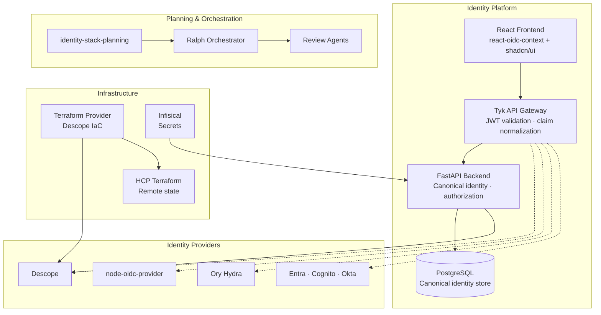
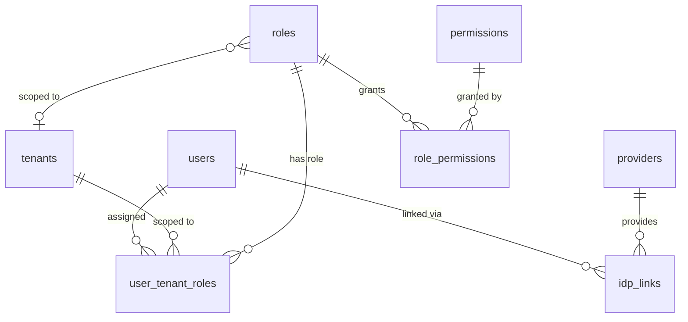
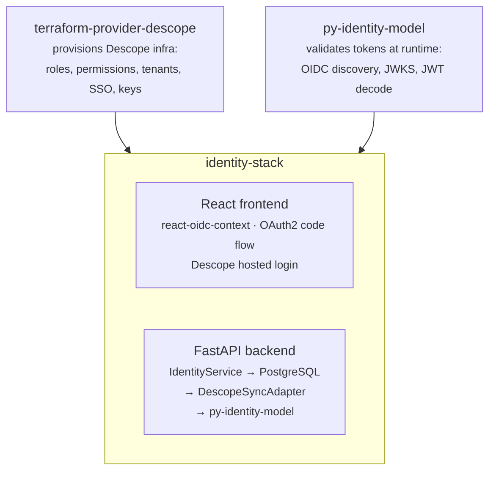
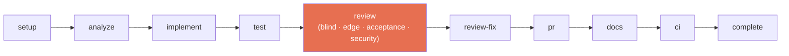

# identity-stack-planning

Planning and orchestration hub for a multi-repo identity platform. This repo contains zero application code — only the planning artifacts, architecture decisions, task tracking, and autonomous execution prompts that drive development across three sibling repositories.

The workspace is also a case study in **agentic software development**: AI agents plan the work (BMAD-METHOD), execute it autonomously (Ralph Orchestrator), and review it adversarially with independent agents that have zero access to the implementation context.

## The Vision

Build a provider-independent identity platform where swapping or adding an identity provider means implementing one adapter — not rewriting the application. The platform starts with Descope, proves the abstraction with a second provider, and delivers a capstone multi-IdP demo.



## The Repositories

### py-identity-model

Production OIDC/OAuth2.0 Python library with dual sync/async APIs. The token validation foundation for the entire platform.

<details><summary>Protocol coverage</summary>

| Category | Coverage |
|----------|----------|
| Core | Discovery (RFC 8414), JWKS (RFC 7517), JWT Validation (RFC 7519) |
| Auth Flows | Auth Code + PKCE (RFC 7636), Device Authorization (RFC 8628), Refresh (RFC 6749 §6) |
| Token Management | Introspection (RFC 7662), Revocation (RFC 7009), Token Exchange (RFC 8693) |
| Security | DPoP (RFC 9449), FAPI 2.0 Security Profile |
| Advanced Requests | PAR (RFC 9126), JAR (RFC 9101) |

</details>

**Status:** v2.17.1 published. All 16 protocol features shipped. 100+ merged PRs. Review fix cycle complete.
**Repo:** [jamescrowley321/py-identity-model](https://github.com/jamescrowley321/py-identity-model)

### terraform-provider-descope

Terraform provider for Descope (Go). Fork of `descope/terraform-provider-descope` extended with additional resources.

<details><summary>Resources</summary>

| Resource | Description |
|----------|-------------|
| `descope_project` | Project configuration |
| `descope_permission` | Permission definitions |
| `descope_role` | Role definitions with permission assignments |
| `descope_tenant` | Tenant/organization configuration |
| `descope_access_key` | Machine-to-machine access keys |
| `descope_sso` | SSO/federation configuration |
| `descope_fga_schema` / `descope_fga_relation` | Fine-grained authorization |
| `descope_password_settings` | Password policy configuration |
| `descope_outbound_application` | Outbound OAuth application |
| `descope_third_party_application` | Third-party application registration |
| `descope_list` | IP/text allow/deny lists |
| `descope_project_export` (data source) | Project configuration export |

</details>

**Status:** Published to Terraform Registry (v1.1.x). 15 resources, 4 data sources. 65+ merged PRs. All review fix cycles complete.
**Repo:** [jamescrowley321/terraform-provider-descope](https://github.com/jamescrowley321/terraform-provider-descope)

### identity-stack

Full-stack SaaS starter with FastAPI backend, Vite/React frontend, and Terraform infrastructure.

<details><summary>Features</summary>

| Feature | Description |
|---------|-------------|
| Session Management | OAuth2 code flow via Descope hosted login, token refresh |
| Tenant Management | Multi-tenant context switching, tenant CRUD |
| RBAC | Role and permission assignment, `require_role()` / `require_permission()` dependencies |
| Fine-Grained Authorization | ReBAC with Descope FGA, document-level access control |
| Admin Portal | User management, role assignment, tenant administration |
| Social Login | Google, GitHub authentication |
| Passkeys | WebAuthn/FIDO2 passwordless authentication |
| Security Hardening | CSP/HSTS/X-Frame headers, structured logging, audit logging |
| Health Checks | Descope API and database connectivity monitoring with retry logic |
| UI Framework | shadcn/ui + Tailwind CSS v4, dark mode, responsive sidebar layout |

</details>

**Status:** Core platform operational. PRD 5 (canonical identity) complete. PRD 5b (design system + admin frontend) active. 44+ merged PRs.
**Repo:** [jamescrowley321/identity-stack](https://github.com/jamescrowley321/identity-stack)

## The Roadmap

Six PRDs define the platform evolution. See [docs/roadmap.md](docs/roadmap.md) for full details and cross-PRD dependencies.

**Active:**
- **PRD 5** (Done) — Canonical identity domain model: Postgres-backed source of truth with 8 SCIM-aligned tables, write-through sync to Descope, webhook inbound sync, multi-IdP identity linking.
- **PRD 5b** (Active) — Design system & admin frontend: purple brand tokens, density system, 8 new components, 5 admin pages, responsive layout. Ralph loop running.

**Next:** PRD 1 (secrets pipeline), PRD 3 (multi-provider test infra)

**Capstone:** PRD 4 (multi-IdP demo) — user authenticates with any provider, gateway normalizes claims, backend operates on canonical identity.

## Architecture

See [docs/system-architecture.md](docs/system-architecture.md) for the full technical overview with C4 diagrams, ER models, request lifecycle, deployment topologies, and consolidated ADR index.

### Provider Abstraction Tiers

Capabilities are classified by cross-provider mapping feasibility (ADR-3):

| Tier | Strategy | Capabilities |
|------|----------|-------------|
| **Tier 1: Abstract** | Common interface across providers | User CRUD, ReBAC/Authz, SSO/Federation, Session Mgmt, M2M Keys, Token Validation |
| **Tier 2: Translate** | Interface + provider-specific adapters | RBAC Roles/Permissions, Password Policy |
| **Tier 3: Provider-Specific** | Don't abstract — too divergent | Multi-Tenancy, Flows/Orchestration, Connectors, JWTs |

### Two-Layer Authorization (RBAC + ReBAC)

Every identity provider models authorization differently, and none are portable. The reference architecture splits authorization into two layers:

- **RBAC in Postgres** — Roles, permissions, and tenant-scoped assignments owned by the application. Provider swap = zero RBAC migration.
- **ReBAC proxied to Zanzibar engines** — Fine-grained resource relationships (Descope FGA, Ory Keto, OpenFGA) called through an abstraction layer. Swapping engines means changing one adapter.

This is a pragmatic middle ground — not the only valid approach. See the [full IdP authorization comparison](docs/idp-rbac-comparison.md) for RBAC and ReBAC analysis across 9 providers, including when simpler models make more sense.

### Canonical Identity Domain Model

The architectural foundation for provider independence (PRD 5). Inverts the current architecture: the backend owns a canonical Postgres store, with identity providers becoming sync targets.



8 tables: `users`, `tenants`, `roles`, `permissions`, `role_permissions`, `user_tenant_roles`, `idp_links`, `providers`. Full schema with field definitions in [system-architecture.md](docs/system-architecture.md#canonical-identity-data-model).

**Write-through sync:** Postgres write first → sync to IdP second → sync failures logged, never rolled back → reconciliation catches up asynchronously.

### Two-Layer Authorization Model (RBAC + ReBAC)

The platform combines role-based and relationship-based access control, each at its natural layer (ADR-2):

| Layer | Question | Data Store | Enforcement | Tenant Isolation |
|-------|----------|-----------|-------------|-----------------|
| **RBAC** | Who are you, what role in this tenant? | Canonical Postgres | `require_role()` / `require_permission()` | `WHERE tenant_id = ?` |
| **ReBAC/FGA** | What is your relationship to this resource? | Descope FGA (proxied, not owned) | `require_fga("document", "can_view")` | Resource ID prefixed with tenant ID |

RBAC handles identity primitives (who you are, your role). FGA handles resource access (your relationship to a specific document). FGA relation tuples stay in provider engines (Descope FGA, Ory Keto) — they're purpose-built for graph evaluation at scale (Zanzibar architecture). The canonical DB owns RBAC; FGA is proxied, never stored locally. Both layers are fail-closed.

### Data Flow



## Agentic Development

Three layers of AI-driven tooling plan, implement, and review code autonomously. See [ralph loop process](docs/ralph-loop-process.md) and [review process](docs/review-process.md) for full details.

### Layer 1: BMAD-METHOD (Planning)

[BMAD-METHOD](https://github.com/bmad-code-org/BMAD-METHOD) v6 provides structured planning with 9 specialized agent personas. Available as `/bmad-*` commands in Claude Code.

<details><summary>Agent personas</summary>

| Persona | Agent | Role |
|---------|-------|------|
| Winston | Architect | System design, API architecture, ADRs |
| Amelia | Developer | Story execution, TDD, code implementation |
| John | Product Manager | PRDs, requirements, stakeholder alignment |
| Mary | Business Analyst | Market research, competitive analysis |
| Quinn | QA Engineer | Test automation, E2E testing, coverage |
| Bob | Scrum Master | Sprint planning, agile ceremonies |
| Sally | UX Designer | User research, interaction design |
| Paige | Tech Writer | Documentation, standards compliance |
| Barry | Quick Flow Solo Dev | Rapid spec-to-implementation |

</details>

### Layer 2: Ralph Orchestrator (Execution)

[Ralph Orchestrator](https://github.com/mikeyobrien/ralph-orchestrator) drives autonomous task execution. A single task queue tracks cross-repo dependencies. Ralph loops execute one phase per iteration:



**Key properties:**
- One phase per iteration with state persisted to disk (crash-recoverable)
- Story loops use git worktrees for filesystem isolation (parallel execution)
- 147+ tasks tracked across 3 repos with cross-repo dependencies
- See [docs/ralph-loop-process.md](docs/ralph-loop-process.md)

### Layer 3: Independent Review Agents (Quality)

Each reviewer runs in a completely fresh context with zero access to the implementation:

| Agent | What It Catches | Trigger |
|-------|----------------|---------|
| **Blind Hunter** | Logic errors, security holes, dead code, resource leaks | Every PR (diff only) |
| **Edge Case Hunter** | Unhandled branches, boundary conditions, async gaps | Every PR (diff + repo) |
| **Acceptance Auditor** | Missing implementations, spec drift, scope creep | Every PR (spec + repo) |
| **Sentinel** | Tenant isolation, auth bypass, injection, JWT attacks | Every PR (security lens) |
| **Viper** | Exploitation paths, privilege escalation, CVSS scoring | Auth/middleware changes only |

Blocking findings must be resolved before the PR can be created. Maximum 3 fix iterations; unresolved findings block the PR for manual intervention. See [docs/review-process.md](docs/review-process.md).

## Project Status

Live status is tracked in the [task queue](_bmad-output/implementation-artifacts/task-queue.md). Use `/ralph-status` in Claude Code for a real-time summary across all repos.

| Repo | Status | Links |
|------|--------|-------|
| terraform-provider-descope | Feature-complete. 1 blocked (SSO app requires enterprise license). | [PRs](https://github.com/jamescrowley321/terraform-provider-descope/pulls) · [Registry](https://registry.terraform.io/providers/jamescrowley321/descope/latest) |
| identity-stack | PRD 5 complete. PRD 5b (design system) active — ralph loop running. | [PRs](https://github.com/jamescrowley321/identity-stack/pulls) |
| py-identity-model | All 16 protocol features shipped. Review fix cycle complete. | [PRs](https://github.com/jamescrowley321/py-identity-model/pulls) · [PyPI](https://pypi.org/project/py-identity-model/) |

## Quick Start

BMAD skills are available as `/bmad-*` commands in Claude Code:

```
/bmad-help                      # Contextual guidance on what to do next
/bmad-pm                        # Product Manager agent
/bmad-architect                 # Architect agent
/bmad-create-prd                # Create a Product Requirements Document
/bmad-create-architecture       # Design system architecture
/bmad-create-epics-and-stories  # Break down work into stories
/bmad-sprint-planning           # Generate sprint plan
/bmad-code-review               # Multi-layer adversarial code review
/ralph-status                   # Monitor active ralph loops across workspace
```

Running a ralph loop:

```bash
cd ~/repos/auth/identity-stack
cp ~/repos/auth/identity-stack-planning/_bmad-output/implementation-artifacts/ralph-prompts/canonical-identity.md PROMPT.md
ralph run

# Monitor
cat .claude/task-state.md
```

## Documentation

Start with the [roadmap](docs/roadmap.md), then explore by topic:

| Document | Description |
|----------|-------------|
| **[Roadmap](docs/roadmap.md)** | PRD sequencing, dependencies, and implementation phases |
| **[System Architecture](docs/system-architecture.md)** | C4 diagrams, ER models, request lifecycle, ADR index |
| **[IdP Authorization Comparison](docs/idp-rbac-comparison.md)** | RBAC and ReBAC across 9 providers: why the reference architecture owns RBAC and proxies ReBAC |
| **[Ralph Loop Process](docs/ralph-loop-process.md)** | How autonomous execution works end-to-end |
| **[Review Process](docs/review-process.md)** | Independent review agents and quality gates |
| **[Glossary](docs/glossary.md)** | Definitions for all terms used across planning docs |
| [Descope Data Model](docs/descope-data-model.md) | OAuth 2.0/OIDC endpoint mapping, JWT claims, tenant model |
| [OIDC Certification](docs/oidc-certification-analysis.md) | OpenID Foundation certification readiness for py-identity-model |

## Repository Structure

```
identity-stack-planning/
  _bmad/                          # BMAD-METHOD v6 (agents, workflows, config)
  _bmad-output/
    planning-artifacts/           # PRDs, architecture docs, epics, design system
    implementation-artifacts/
      task-queue.md               # Cross-repo task tracker
      sprint-plan.md              # Prioritized sprint plan
      ralph-prompts/              # Loop prompts for autonomous execution
        phases/                   # Per-phase prompt templates
        review-agents/            # Independent reviewer templates
      ralph-runner-guide.md       # Running and monitoring ralph loops
  docs/                           # Project knowledge base (see docs/index.md)
  _archive/                       # Historical research and completed reviews
  .claude/skills/                 # 45 BMAD skills + ralph-status
```

## License

Apache License 2.0. See [LICENSE](LICENSE) for full text.
