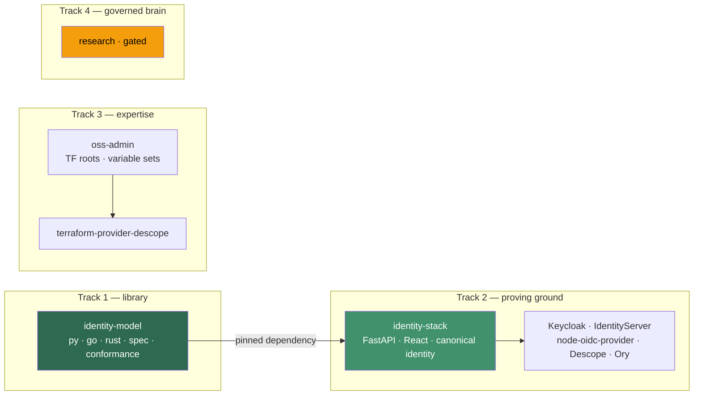

# Identity Stack Brain

*The repository is `identity-stack-planning`; the name is pending the
[open-identity rebrand](docs/idea-open-identity.md), planned in September 2026 and never
started.*

**[Read it as a site → jamescrowley321.github.io/identity-stack-planning](https://jamescrowley321.github.io/identity-stack-planning/)**

Planning and orchestration hub for a multi-repo identity platform. **Zero application code** —
only the architecture decisions, domain research, and autonomous-execution prompts that drive
development across four sibling repositories.

It is also a case study in **agentic software development**: AI agents plan the work
(BMAD-METHOD), execute it autonomously (Ralph Orchestrator), and review it adversarially in
fresh contexts with no access to the implementation.

## What this is

Four independent tracks, not one program. **They do not gate each other.**

| Track | Goal | Repos |
|---|---|---|
| **Library** | A credible, certified, multi-language open-source identity library | `identity-model` |
| **Proving ground** | Run the library against real providers end to end, in a working application | `identity-stack` |
| **Expertise** | Keep provider tooling and repository governance in working order | `terraform-provider-descope`, `oss-admin` |
| **Governed brain** | Research: agent memory as an authorization problem. Gated, nothing built | — |

```mermaid
graph LR
    subgraph t1["Track 1 — library"]
        IM["identity-model<br/>py · go · rust · spec · conformance"]
    end
    subgraph t2["Track 2 — proving ground"]
        IS["identity-stack<br/>FastAPI · React · canonical identity"]
        PROV["Keycloak · IdentityServer<br/>node-oidc-provider · Descope · Ory"]
    end
    subgraph t3["Track 3 — expertise"]
        TFP["terraform-provider-descope"]
        OSS["oss-admin<br/>TF roots · variable sets"]
    end
    subgraph t4["Track 4 — governed brain"]
        GB["research · gated"]
    end
    IM -->|"pinned dependency"| IS
    IS --> PROV
    OSS --> TFP

    style IM fill:#2d6a4f,color:#fff
    style IS fill:#40916c,color:#fff
    style GB fill:#f59e0b,color:#000
```

The one real coupling is that arrow: `identity-stack/backend` depends on `py-identity-model`
for token validation. Everything else is independent.

The library is the flagship, and Python is **OpenID Certified® by the OpenID Foundation as a
Relying Party** — Basic, Config and Form Post Basic RP, since 2 July 2026. It is the certified
reference the family's Go and Rust native libraries are built to match.

`identity-stack` is **not a product**. It is where the library gets run end to end against
real providers rather than test doubles — POC-grade by design. Any given provider in it is
one implementation of the standards, not the subject.

Full detail: **[docs/roadmap.md](docs/roadmap.md)**.

## The repositories

Each repository documents its own capabilities and ships its own release notes. This table
links; it does not restate.

| Repository | What it is | Release |
|---|---|---|
| [identity-model](https://github.com/jamescrowley321/identity-model) | Multi-language OIDC/OAuth2 **client** library — `py/ go/ rust/ spec/ conformance/` behind one harness. Provider-agnostic: one conformance suite runs against Keycloak, IdentityServer, node-oidc-provider and Descope. OpenID Certified RP |  |
| [identity-stack](https://github.com/jamescrowley321/identity-stack) | Proving ground — FastAPI + React + Terraform, canonical Postgres identity, Tyk gateway, Descope and Ory | — |
| [terraform-provider-descope](https://github.com/jamescrowley321/terraform-provider-descope) | Terraform provider for Descope (Go), fork of the upstream provider — tooling for one of the providers, not a dependency of the library |  |
| [oss-admin](https://github.com/jamescrowley321/oss-admin) *(private)* | One Terraform root per administered repo — GitHub settings, branch protection, CI secrets | — |

## Where things live

| Path | Holds |
|---|---|
| [`docs/`](docs/index.md) | The knowledge base, published as the site — program map, architecture, identity-domain analysis, governed-brain research |
| [`_bmad-output/planning-artifacts/`](_bmad-output/planning-artifacts/) | Epics and product briefs, each linked to its tracking issue |
| [`_bmad-output/implementation-artifacts/`](_bmad-output/implementation-artifacts/) | Ralph loop prompts, the runner guide, and the artifact → issue map |
| [`_archive/README.md`](_archive/README.md) | What was retired, why, and the `git show` that prints it back. The files live only in git history |
| [`AGENTS.md`](AGENTS.md) | Instructions for AI agents working in this repo |
| `_bmad/` | Vendored BMAD-METHOD v6 install — not edited by hand |

## How work gets done

Three layers, each documented in full:

1. **[BMAD-METHOD](https://github.com/bmad-code-org/BMAD-METHOD) plans** — product briefs, epics and stories, available as `/bmad-*` skills in Claude Code.
2. **[Ralph Orchestrator](https://github.com/mikeyobrien/ralph-orchestrator) executes** — one phase per iteration, state persisted to disk, git worktrees for isolation. See [ralph loop process](docs/ralph-loop-process.md) and the [runner guide](_bmad-output/implementation-artifacts/ralph-runner-guide.md).
3. **Independent agents review** — each reviewer runs in a fresh context with zero access to the implementation, so it reads the code cold. See [review process](docs/review-process.md).

Loops never merge their own pull requests.

## Where status lives

**GitHub issues are the source of truth.** Planning artifacts here hold the *why* and the
decomposition; they never carry status. `task-queue.md` and `sprint-plan.md` were retired on
2026-09-05 for drifting from the issues they duplicated — a hand-reconciled tracker always
loses to the system that updates itself.

The artifact → issue map is
[`status.md`](_bmad-output/implementation-artifacts/status.md); it contains no status words,
only stable identifiers.

## For agents

Start at **[AGENTS.md](AGENTS.md)** — what is authoritative, how work is named, which sibling
repository to ground against, and what not to touch. Claude Code reads
[`CLAUDE.md`](CLAUDE.md), which imports it.

Two machine-readable files publish at the site root:

| File | Holds |
|---|---|
| [`llms.txt`](https://jamescrowley321.github.io/identity-stack-planning/llms.txt) | Curated index in [llmstxt.org](https://llmstxt.org/) format — what to read, in what order, with the three governing rules stated up front |
| [`workspace.yml`](https://jamescrowley321.github.io/identity-stack-planning/workspace.yml) | The facts that drift: local directory to GitHub repository mapping, package identities, tracks, and the do-not-touch list |

`workspace.yml` is a mirror, not a source. The prose is authoritative; the manifest carries
its own verification date.

## Contributing

This is a planning repository, so a contribution is a change to a *plan*. See
[CONTRIBUTING.md](CONTRIBUTING.md). Vulnerabilities in the code these plans describe belong in
the relevant repository — see [SECURITY.md](SECURITY.md).

## License

Apache License 2.0. See [LICENSE](LICENSE).
