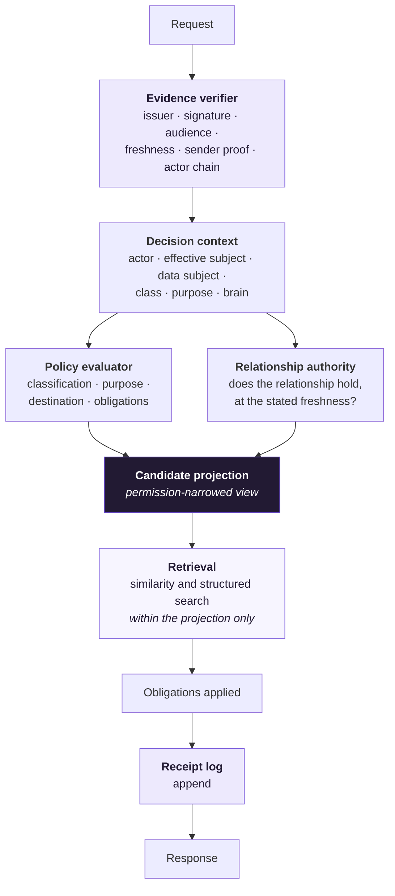
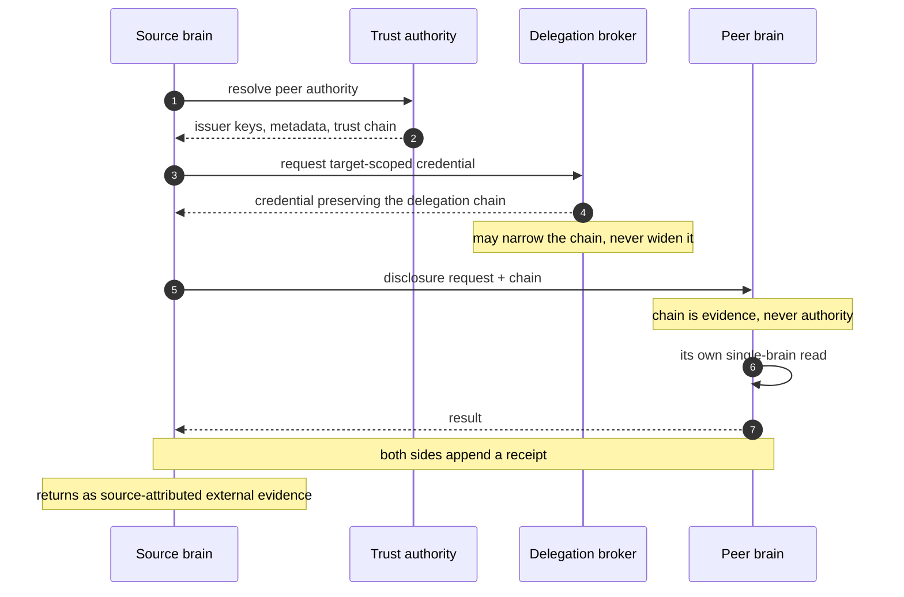

# Governed Brain — Abstract Architecture

**Status:** Proposed · **Date:** 2026-09-15

The technology-free layer. This document defines the components, the contracts
between them, and the properties any implementation must exhibit. It names no
product, vendor, engine, database, identity provider, or repository, and it is
not a deployment design.

Everywhere a tool would appear, there is instead a **substitution point**: a port
with a contract, a class of technology that could satisfy it, the criteria a
candidate must meet, and what disqualifies one. Choosing those tools is a
separate, later decision — [Where It Stands](governed-brain-where-it-stands.md)
carries the four that have to be made first, and the
[implementation plan](governed-brain-implementation-plan.md) sequences the work
once they are.

Read alongside the [concepts](governed-brain-concepts.md), which define what a
governed brain must mean, and the
[authorization model](governed-brain-authorization.md), which defines how one
decision composes.

## Why abstract first

A contract that names a vendor inherits that vendor's gaps as requirements, and
two years later nobody can tell which parts of the design were reasoning and
which were accommodation. Fixing the contract first means a tool can be swapped
by writing one adapter and running the same conformance vectors against it —
and it means the vendor evaluation has a yardstick that was written before
anyone was trying to justify a choice.

The cost is real and worth stating: an extra indirection at every boundary, and
some capability that a specific tool offers natively will have to be rebuilt
above the port or given up. The rule below keeps that cost bounded.

**Rule.** A port exists where substitution is plausible and the contract is
expressible. Where neither holds, the architecture states a direct dependency
and says so, rather than pretending to an abstraction it cannot honor.

## Components

Roles, not processes. Several may collapse into one deployable unit; none may
collapse their *responsibilities* into another.

| Component | Owns | Must not own |
|---|---|---|
| **Brain authority** | Scope identity, lifecycle, capability set, authority boundary; the decision to disclose | Storage mechanics, retrieval ranking, relationship truth |
| **Record store** | Governed records, revisions, classification, source attribution | Authorization decisions; rewriting source authority |
| **Candidate projection** | A permission-narrowed view of what a given decision context may see | Any widening; being the system of record |
| **Retrieval** | Similarity and structured search *within* a projection | Reaching records outside the projection it was given |
| **Relationship authority** | Whether a relationship holds between actor, subject, and object, at a stated freshness | Brain vocabulary, record content, purpose semantics |
| **Policy evaluator** | Classification, purpose, destination, and obligation rules | Relationship truth; identity verification |
| **Grant registry** | Grants as first-class objects: issue, resolve, coverage, supersession, revocation state | Being derivable from a token alone |
| **Receipt log** | The durable, independently checkable record of decisions and disclosures | Being editable by the party it describes |
| **Evidence verifier** | Issuer, signature, audience, freshness, sender proof, actor chain | Deciding authorization; knowing what a brain is |
| **Trust authority** | Which issuers and peer brains are authoritative, their keys and metadata | Per-request authorization |
| **Delegation broker** | Minting a target-scoped credential that preserves the delegation chain | Widening the chain; impersonation |
| **Event distributor** | Propagating state changes — revocation, supersession, deletion | Being the authority for a local decision |
| **Review workflow** | Promotion from observation to approved truth, with maker-checker | Letting activity alone create approval |

Two components exist specifically because the research found the design assuming
them without naming them: the **candidate projection** (nothing else can narrow a
retrieval safely at scale) and the **grant registry** (a grant that lives only
inside a token cannot be queried, superseded, or proven later).

## Ports

Each port states its operations, the guarantee it must make, how it fails, and
the negative test that proves it. Operation shapes are illustrative pseudo-form,
not a wire format.

### EvidencePort

```text
verify(credential, expected_audience, expected_binding) -> VerifiedEvidence | Failure
```

Returns the verified actor, the effective subject, the actor chain, the granted
authorization details, sender-proof status, and issuer identity. **Guarantee:**
never returns partially verified evidence — a failed term is a failure, not a
flag on a success. **Fails:** closed, with a machine-readable reason.
**Negative test:** evidence valid for a different audience, a different binding,
or a superseded key is rejected, and the rejection reason distinguishes them.

### RelationshipPort

```text
check(actor, relation, object, consistency) -> Decision
check_batch(actor, [(relation, object)], consistency) -> [Decision]
record_change(write) -> FreshnessToken
```

**Guarantee:** `consistency` is a *typed* value — at minimum a mode plus an
optional freshness token — and an implementation that cannot honor the requested
mode must fail rather than silently serve a weaker one. `record_change` returns
a token the caller stores atomically with the content it wrote, and replays on
later checks; without that leg a revocation can be outrun by a cached decision.
**Fails:** closed; unavailable is not allow. **Negative tests:** a permission
revoked before a read is never served from a cache keyed on anything but a
snapshot; a request for strong consistency against an engine that cannot provide
it is refused, not downgraded.

### ProjectionPort

```text
subscribe(authorization_change_stream) -> ()
candidates(decision_context, selectors) -> CandidateSet
staleness() -> Bound
```

**Guarantee:** a projection may only ever **narrow** relative to a direct
authorization evaluation. It may lag, and it must report its lag, but it must
never include what a direct check would deny. **Fails:** closed — an unavailable
or unbounded-stale projection yields an empty candidate set, not an unfiltered
one. **Negative test:** for a sampled population of decision contexts, every
member of `candidates()` is independently confirmed by `check()`; any excess is a
build-breaking defect, any shortfall is a latency bug.

### PolicyPort

```text
evaluate(decision_context) -> Decision + Obligations
```

**Guarantee:** returns obligations (redaction, minimisation, result limits) as
first-class output, not as advice. An obligation that the caller cannot apply is
a denial. **Fails:** closed. **Negative test:** a decision context whose
obligations are dropped by the caller produces no disclosure.

### GrantPort

```text
issue(grant) -> GrantRef
covers(grant_ref, request) -> Covered | NotCovered(reason)
status_at(grant_ref, instant) -> SignedStatus
revoke(grant_ref, initiator, reason) -> Receipt
```

**Guarantee:** `covers` is the algorithm that decides whether an existing
authority already permits a request — the single thing that separates a grant
from a checkbox. `status_at` is *provable after the fact*, not a boolean read
now. **Fails:** closed; unknown coverage is not coverage. **Negative test:** a
request differing from the grant in purpose, class, selector breadth, or onward
disclosure is `NotCovered`, with the reason naming the differing term.

### ReceiptPort

```text
append(receipt) -> Anchor
prove(receipt_id) -> InclusionProof
verify(receipt, proof) -> Verified | Failure
```

**Guarantee:** a party other than the issuer can check that a receipt exists,
has not changed, and was not backdated — and that the issuer did not tell two
parties different things. **Fails:** an unavailable log blocks the disclosure it
would record, unless the deployment has explicitly accepted a weaker promise and
says so in its capability statement. **Negative test:** a receipt altered after
anchoring fails verification; a receipt omitted from the log is detectable.

### TrustPort

```text
resolve(peer_identifier) -> PeerAuthority | Failure
```

**Guarantee:** binds a peer brain or issuer to its authoritative metadata and
keys through a path that a third party could re-walk. **Fails:** closed.
**Negative test:** metadata whose self-declared identity differs from the
identifier it was fetched under is rejected.

### EventPort, ApprovalPort, RecordPort

`EventPort` distributes state changes and is explicitly **not** authoritative:
local grant state decides local requests, and event delivery is a convergence
mechanism with a published bound. `ApprovalPort` records that a required human
decision happened, and returns a reference the receipt carries. `RecordPort`
reads and writes governed records with their revision, classification, and
source attribution, and cannot mutate source authority.

## Invariants

Properties that hold across every component. These are what a conformance suite
tests; the phases exist to make them true.

| # | Invariant |
|---|---|
| I1 | Every disclosure is a conjunction of all applicable terms; any failed term denies |
| I2 | Authorization narrows the candidate set **before** any learned component runs |
| I3 | The decision evaluates **granted** authority, never requested authority |
| I4 | Every port fails closed; unavailable is never allow |
| I5 | Local grant state is authoritative for a local decision; upstream events converge it |
| I6 | Purpose is attested, not proven — entitlement to declare it is enforced, absence denies, and the declaration is recorded |
| I7 | A projection may only narrow, never widen |
| I8 | Every disclosure, denial, grant, and revocation produces a receipt |
| I9 | Source authority survives every copy, projection, and promotion |
| I10 | No brain vocabulary enters the identity layer — the dependency runs one way |

## Flows

**Single-brain read.** Evidence verified → decision context assembled (actor,
effective subject, data subject, class, purpose, brain) → policy and relationship
terms evaluated → projection yields candidates → retrieval runs *within* those
candidates → obligations applied → receipt appended → response.



Retrieval never reaches outside the projection it was given. That is what makes
the narrowing a security boundary rather than a ranking optimisation, and it is
why the projection is a named component instead of an implementation detail.

**Cross-brain disclosure.** Peer authority resolved through the trust port →
delegation broker mints a target-scoped credential preserving the chain →
target brain runs its own single-brain read, treating the chain as evidence and
never as authority → both sides receipt → result returns as source-attributed
external evidence, never as the recipient's own truth.



**Revocation.** Revocation recorded in the grant registry → its own receipt →
distributed as an event → recipients converge within a published bound →
projections rebuild → derived copies follow the declared handling policy. The
bound is published because it cannot be zero.

**Promotion.** Observation, retrieval, and model output enter as proposals →
review workflow applies maker-checker → approved truth is written with its
provenance → nothing about the promotion path lets an agent widen its own
authority.

## Substitution points

What may be chosen later, and the yardstick for choosing. No candidate is named
here on purpose.

| Port | Class of technology | Must have | Disqualifying | Proof before adoption |
|---|---|---|---|---|
| RelationshipPort | Relationship/graph authorization engine | Typed consistency with a freshness token; a write-side change check; batch check; a change stream a projection can consume | Declaring consistency controls it does not implement; a bulk operation its own documentation says is unsuitable for access control, with no projection path | Two adapters — one real, one synthetic in-memory — passing identical vectors, including the revocation-race negative test |
| ProjectionPort | Materialized view, search index, or stream processor | Deterministic rebuild; a measurable staleness bound; narrowing verified by sampling against direct checks | Any path that can widen; unbounded or unreportable lag | Sampled equivalence against `check()` in CI, plus a rebuild-from-empty test |
| EvidencePort | Identity provider and token verification libraries | The flows the model needs — request-bound authorization detail, delegated exchange, sender-constrained tokens, key rotation, event delivery | Provider-specific claims required for a decision; no way to verify without calling the provider per request | The same conformance vectors pass against two issuers, one of them synthetic |
| PolicyPort | Policy engine | Obligations as output; deterministic, testable decisions; a versionable policy artifact | Decisions that cannot be reproduced from inputs plus policy version | Golden-case suite runs against a stored policy version |
| GrantPort | Datastore plus the coverage algorithm | Point-in-time provable status; supersession; coverage comparison | Grants expressible only as a token claim | Coverage truth table, including the near-miss cases |
| ReceiptPort | Append-only log with inclusion proofs | Third-party verifiable; non-equivocating; retention tiering | A log the issuer can rewrite; a public one that leaks by existing | Tamper and omission detection tests |
| TrustPort | Federation metadata mechanism | A re-walkable path from identifier to keys; policy that can only narrow | Manual key distribution as the steady state | Two-authority resolution test with rotation |
| Record store, retrieval | Database, index | Revision identity; classification carried with the record | Losing source attribution on copy | Provenance round-trip test |

### On the identity provider specifically

The brain depends on **verified evidence** and **issuer authority** — not on a
provider. Any provider satisfying the EvidencePort and TrustPort criteria is
admissible, and the choice is reversible in proportion to how little
provider-specific vocabulary leaks past those two ports.

Three rules keep it reversible. The canonical subject, tenant, and relationship
state stay authoritative locally, with the provider treated as a projection of
them rather than their owner — so a change of provider is a re-projection, not a
migration. No decision term reads a provider-proprietary claim; anything needed
for a decision is normalized at the port boundary. And the conformance vectors
run against at least two issuers, one synthetic, from the first phase that has
any — because provider independence claimed but never exercised is an assumption,
not a property.

## What this does not decide

Deployment topology, storage engines, language bindings, hosting, the wire
format for cross-brain exchange, the retention and erasure position, and every
product name. Those follow the four open decisions and the selection criteria
above — in that order, and recorded as decisions when they are made.
