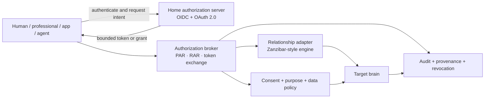
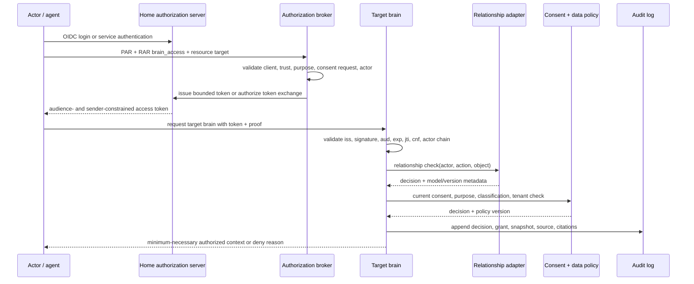

# Governed Brain — Authorization and Federation Model

**Status:** Proposed · **Date:** 2026-09-15 · **Companion to:** [Concepts and Requirements](governed-brain-concepts.md)

This document defines how a disclosure decision is composed for a governed
brain, and how two independently governed brains exchange bounded information.
It is a **protocol profile** built from established standards plus one
product-specific authorization detail — not a claim that a standard named
"brain federation" already exists.

Nothing here is deployed or certified.

## Decision in one page

1. **OIDC / OAuth 2.0** authenticates a human, service, or agent and issues a
   token for one target brain or API. Use authorization code + PKCE for user
   agents and the current OAuth security baseline in
   [RFC 9700](https://www.rfc-editor.org/rfc/rfc9700.html).
2. **FAPI 2.0** is the hardening profile for high-value clients. Apply its PAR,
   PKCE, sender-constrained-token, and asymmetric client-authentication
   requirements where the risk assessment calls for them. Do not make "FAPI
   compliant" a present-tense claim — see the FAPI section of the
   [gap analysis](identity-capability-gap-analysis-2026-09-05.md).
3. **RAR + PAR + Resource Indicators** express the exact requested brain,
   actions, purpose, and bounded data scope. A broad `brain.read` scope is not
   enough for a cross-principal exchange. See
   [RAR (RFC 9396)](https://www.rfc-editor.org/rfc/rfc9396.html),
   [PAR (RFC 9126)](https://www.rfc-editor.org/rfc/rfc9126.html), and
   [Resource Indicators (RFC 8707)](https://www.rfc-editor.org/rfc/rfc8707.html).
4. **A Zanzibar-style relationship engine is the first relationship adapter.**
   Model brain, organization, collection, record, agent, and grant
   relationships. Keep it behind the provider-neutral
   `RelationshipAuthorizationPort` this workspace already committed to; route
   handlers must never call a relationship engine's API directly. The graph
   answers "does this actor have this relationship to this object?" It does not
   become the authority for consent, purpose, source authority, retention, or
   tenant isolation.
5. **Policy and the brain remain authoritative for context.** The final decision
   intersects identity, target audience, sender proof, the relationship graph,
   current consent, purpose, data classification, tenant boundary, grant
   expiry/revocation, and any human-approval requirement.

## The security invariant

Every read, write, proposal, export, or model-context operation is evaluated as
a conjunction, never as an unqualified token claim:

```text
allow =
  verified_issuer_and_signature
  AND valid_time_and_nonce_or_replay_protection
  AND audience_matches_target_brain
  AND sender_proof_matches_token
  AND token_intent_allows(action, object, purpose)
  AND actor_chain_is_valid
  AND relationship_graph_allows(actor, action, object)
  AND current_consent_allows(data_subject, purpose, object)
  AND data_policy_allows(classification, purpose, destination)
  AND tenant_and_environment_match
  AND grant_is_current_and_not_revoked
  AND human_approval_exists_when_required
```

Any failed term is deny-by-default. A token is evidence about an authorization
request; it is not a permanent ACL and does not override a current deny, a
withdrawn consent, a legal hold, a source-system restriction, or a tenant
boundary.

Two properties of the conjunction are as load-bearing as its terms.

**Ordering.** The conjunction MUST constrain the candidate set *before* any
learned component runs — retrieval, ranking, reranking, or generation. Evaluating
the same terms after retrieval is a different and weaker system: published
measurement of retrieve-then-filter pipelines found unauthorized context reaching
the model in the large majority of queries, because the filtered-out material has
already influenced scoring, counts, and what the remaining results mean. "The
check runs" is not the requirement; "nothing unauthorized is ever a candidate" is.

**Which authorization details.** Where a request carries authorization details
and the authorization server may enrich, reduce, or otherwise modify them, the
conjunction MUST be evaluated over the **granted** details bound to the token,
never the ones the client asked for. Scope and authorization details are granted
as a merged set, so a scope value MUST NOT be able to confer brain access on its
own.

## Roles and authority boundaries

These are domain roles, not legal conclusions. One person or organization may
occupy several roles for the same object, but the roles must stay
distinguishable in audit records.

| Term | Meaning in this model | Important boundary |
|---|---|---|
| **Data subject** | The person the data describes | `sub` in an OAuth token is not automatically the data subject |
| **Controller** | Party deciding purpose and means for a governed collection | Legal controller status requires jurisdiction-specific review |
| **Custodian** | Party operating storage or a service holding a copy | Custody does not grant unrestricted read authority |
| **Steward** | Authorized operator managing a brain's governance, members, policies, and review queue | Stewardship is not permission to read every record |
| **Delegate** | Principal authorized to act for another within a bounded grant | Delegation must be explicit, time-bounded, and auditable |
| **Actor** | The immediate human, service, or agent executing the request | Never inferred from a display name alone |
| **Source authority** | The system that remains authoritative for a record | A brain copy carries provenance and cannot silently become the source |

An individual may control a personal brain containing their notes, preferences,
agent settings, and contributed material. That does not mean they can rewrite a
record that an external system owns. Likewise, an organization administrator may
administer an organization brain without being granted access to every
individual principal brain inside it.

## Brain types and relationship policy

All brain types share one contract and differ only in default stewardship and
data policy.

| Brain type | Default steward | Typical grants | Required extra checks |
|---|---|---|---|
| Principal / personal | The individual, subject to product and legal policy | Their own agent; a selected professional or delegate; export to a named destination | Consent, purpose, minimum necessary, sensitive-class rules, withdrawal |
| Professional / team | A practitioner or team organization | Team members, delegated agents, subject-directed exchange | Purpose, team relationship, organization policy, source authority |
| Organization / tenant | Tenant governance administrators | Members, service principals, approved products, auditors | Tenant boundary, role separation, maker-checker, environment and export policy |
| Shared / federated | Each contributing brain keeps local authority | A remote grant for named actions and objects | Issuer trust, audience, actor chain, grant expiry, local policy, provenance, revocation |
| Agent context | The person or organization owning the agent configuration | Agent may retrieve or propose; commit needs an explicit grant and often human approval | Agent version, tool grant, snapshot pin, model/data policy, autonomy class |

The relationship graph expresses who is related to what. It must not encode a
claim that one role universally means owner, read-all, or unrestricted access.

## Layered architecture



### Layer responsibilities

| Layer | Owns | Must not own |
|---|---|---|
| Identity provider / authorization server | Authentication, issuer keys, clients, login assurance, token issuance | The record-level policy graph or source-system consent truth |
| Authorization broker | Trust configuration, request validation, token exchange, policy composition, admin and review | A browser-only authorization decision or unbounded impersonation |
| Relationship adapter | Relationship and permission checks over brain objects | Consent, purpose, legal basis, retention, classification, issuer trust |
| Brain | Versioned records, grants, source provenance, consent references, policy versions, snapshots, audit | Autonomous promotion of generated text to truth |
| Database and object store | Row- and object-level isolation and storage enforcement | Treating an object path, bucket prefix, or UI route as authorization |
| Product / agent runtime | Requesting context and executing an approved operation | Expanding its own grants, approving its own proposals, or choosing a different policy path |

## The relationship-authorization port

This workspace already committed to relationship authorization as an
**external, proxied capability** behind a provider-neutral port rather than an
engine implemented here. A governed brain reuses that port unchanged; it only
adds new resource types behind it.

```text
RelationshipAuthorizationPort.check(
  actor_principal,
  action,
  resource_type,
  resource_id,
  tenant_id,
  consistency_requirement,
) -> { allowed, relation, model_id, tuple_snapshot, checked_at }
```

The adapter must:

- accept only verified canonical subject identifiers, never an email address;
- require an explicit resource type and object ID;
- receive tenant and environment context as checked inputs;
- select a consistency mode appropriate to the operation;
- return the model/schema version and decision metadata for audit;
- fail closed on timeout, unknown model, stale configuration, or ambiguous
  subject mapping; and
- never be the only check for a sensitive-class response.

### Illustrative relationship model

A model shape to validate against an engine's model compiler and conformance
tests. Not an implementation file, not a final schema.

```text
model
  schema 1.1

type user
type service

type organization
  relations
    define member: [user, service]

type brain
  relations
    define owner: [user]
    define steward: [user, organization#member]
    define member: [user, organization#member]
    define reader: [user, organization#member]
    define writer: [user, organization#member]
    define proposer: [user, service, organization#member]
    define approver: [user, organization#member]
    define auditor: [user, organization#member]
    define can_read: owner or reader or writer or proposer
    define can_propose: owner or writer or proposer
    define can_approve: approver
    define can_audit: auditor
    define can_administer: owner or steward

type brain_record
  relations
    define parent: [brain]
    define direct_reader: [user, service, organization#member]
    define direct_writer: [user, service, organization#member]
    define can_read: direct_reader or reader from parent
    define can_propose: direct_writer or writer from parent
```

Before this model is used for sensitive data it must add and test: organization
membership revocation, nested teams, delegated agents, record-level overrides,
deny semantics, separation of proposer and approver, cross-tenant negative
cases, source-authority restrictions, and stale/revoked grant behavior. Engine
conditions may be evaluated later, but the first sensitive lane should keep
consent and purpose in the policy layer so they stay independently observable
and testable.

### What belongs where

| Question | Decision system | Why |
|---|---|---|
| Is this issuer, client, or actor authenticated? | Authorization server and token verifier | Cryptographic issuer, client, and token validation |
| Is the token meant for this brain? | Audience / resource validation | Prevents confused-deputy and multi-resource bearer reuse |
| Is the actor a member, steward, writer, or delegate? | Relationship adapter | Relationship traversal and inheritance |
| Is this purpose allowed for this data? | Policy and consent service | Purpose and sensitive-class rules are not generic object relations |
| Has the subject withdrawn the grant? | Brain grant/consent state plus revocation path | Current state can change after token issuance |
| Is this row returned from the database? | Row-level security and application policy | Graph checks do not protect an unfiltered query or index |
| May an agent commit a consequential action? | Agent grant plus human-approval policy | Retrieval and proposal authority is not commit authority |

## Capability reuse and current gaps

The libraries in this workspace supply real building blocks, but they are not a
drop-in authorization system for a brain. The table records what to reuse and
what must be closed first. Status refers to the identity projects themselves,
not to any brain deployment.

| Capability | Why it helps | Current gap | Treatment |
|---|---|---|---|
| Core OIDC/OAuth verification | One place to validate discovery, keys, signatures, auth-code + PKCE, client credentials, and UserInfo behavior | Cross-language status differs; brain-specific audience, resource, sender-proof, actor-chain, and grant checks are not supplied by generic token validation | Reuse a verifier port and canonical principal; keep brain authorization outside the token library |
| Callback `state` (or PKCE, or `nonce`) validation | Closes login-CSRF by binding the callback to the user-agent session | Go and Rust clients lack a callback builder/parser surface for this | Unconditional client conformance (RFC 9700 §4.7) — a single-issuer control, not a federation gate; add executable callback vectors |
| Callback `iss` validation (RFC 9207) | Closes authorization-response mix-up, whose preconditions require a second, attacker-operated authorization server (RFC 9700 §4.4.1) | Same missing callback surface; distinct per-issuer redirect URIs (RFC 9700 §4.4.2.2) are the fallback defence where `iss` is unavailable | Federation-pilot gate, and only for front-channel authorization responses — see the sequencing note in the implementation plan |
| Discovery endpoint-authority binding | Stops a malicious discovery document redirecting key or token requests | Not enforced consistently across implementations | Unconditional: RFC 8414 §3.3 requires the returned `issuer` to be identical to the issuer identifier the well-known URI was built from, and the response MUST NOT be used otherwise. Enforce with explicit alias and loopback exceptions |
| Bounded discovery/JWKS caches, single-flight fetch | Limits memory growth and duplicate key fetches during rotation or cache miss | Cache-entry limits absent in Go and Rust paths; Rust also lacks concurrent-fetch dedup | Availability and resource hygiene with no multi-issuer precondition; implement independent of federation timing and publish staleness and failure semantics |
| Introspection and revocation | Lets a target brain react when a token or grant dies before expiry | Not at cross-language parity; local grant revocation must not depend only on an upstream endpoint | Use revocation events plus local grant state as the authority; add introspection where the trust profile needs it |
| Token Exchange (RFC 8693) | Lets a broker mint a target-brain token while preserving the delegation chain | Exchange support and actor semantics need cross-language and product-level tests | Use for bounded delegation; never as unrestricted impersonation |
| DPoP or mTLS | Makes a copied token far less useful by binding it to a key or certificate | Sender-constrained flows are not a complete profile across clients and deployment modes | DPoP for suitable software clients, mTLS for managed links; test replay, rotation, proxy behavior |
| PAR, RAR, Resource Indicators | Expresses a named brain, actions, purpose, and subject instead of a broad role | Not uniformly available across language bindings and resource-server surfaces | Make `brain_access` a versioned RAR contract; use PAR and resource restriction for high-risk flows |
| Executable cross-language conformance | Stops Go, Rust, Python, and TypeScript clients interpreting issuer, audience, actor, proof, and authorization details differently | Many prose contracts, limited executable vectors, incomplete language coverage | Extend shared vectors to brain access, callback validation, delegation, DPoP, resource indicators, and negative cases |
| Canonical identity store and provider links | Lets one person or organization appear across several identity providers while tenant assignment stays canonical | Provider correlation is not proof of data-subject authority or a brain grant | Reuse canonical subject/tenant mapping as an input; keep grants, consent, and source authority in the brain |
| Relationship-authorization seam | An owner/editor/viewer model plus a check abstraction is a practical adapter starting point | No brain, collection, record, agent, grant, source-authority, consent, deny, or cross-tenant semantics | Reuse the adapter pattern only; compile a brain-specific model with negative tests |
| Standalone vs gateway verification | Makes the verifier boundary and proxy trust decision explicit per deployment | Forwarded identity headers are safe only under an authenticated gateway trust contract | One resource-server verification contract, trusted-proxy allowlist, header provenance, fail-closed behavior |

### Reuse order

1. **Close the security-normative client gaps:** callback `iss`/`state`,
   discovery authority binding, bounded caches, concurrent JWKS fetch.
2. **Define the shared brain contract:** canonical subject and actor mapping,
   `brain_access`, target resource and audience rules, grant lifecycle, denial
   codes, conformance vectors.
3. **Add delegation and sender proof:** token exchange, DPoP or mTLS, revocation
   events, replay handling.
4. **Build the relationship adapter:** compile and test the brain-specific
   model, keeping consent, purpose, source authority, and classification in the
   policy layer.
5. **Add high-assurance profiles and ergonomics:** PAR/RAR hardening, FAPI 2.0
   where risk selects it, framework middleware, client bindings.

The highest-value reuse is the verifier boundary, canonical identity and tenant
mapping, conformance machinery, the relationship-adapter seam, and hardened
operational controls. The highest-priority missing work is the security
hardening above plus the brain-specific policy composition that sits on top.

## Protocol profile

### Interactive clients

- OIDC authorization code flow with **PKCE S256**. Never the implicit flow.
  Validate exact issuer, redirect URI, state/nonce, authorization response,
  code, audience, and signing algorithm.
- **PAR** when the request carries sensitive authorization details, a
  cross-principal relationship, or a high-risk client — the front channel then
  carries a short-lived request URI rather than the full request object.
- **RAR** to request a named `brain_access` detail rather than a broad role.
- **FAPI 2.0** for high-value or cross-organization profiles, after confirming
  which profile and client type fit the deployment.

### Service and agent clients

- Client credentials for a service acting only as itself.
- Sender-constrained tokens — **DPoP** for suitable software clients, **mTLS**
  for managed service-to-service links. A bearer token copied from one workload
  must not suffice to call another brain where risk requires proof of
  possession.
- **Resource Indicators** so an access token is scoped to one target brain or
  API. Avoid multi-audience tokens spanning unrelated tenants.
- Keep service identity and agent identity separate. The agent's version,
  deployment, tool grant, and model/data policy are recorded in the brain.

### Delegated actions

Use [OAuth 2.0 Token Exchange (RFC 8693)](https://www.rfc-editor.org/rfc/rfc8693.html)
when a broker exchanges a home token for a target-brain token, preserving
delegation semantics:

- `sub` identifies the OAuth subject of the issued token and is not silently
  mapped to the data subject;
- `act` identifies the immediate acting party when the exchange represents
  delegation; and
- a separate domain field in `authorization_details` identifies the data subject
  when the target record is about someone else.

Never turn delegated access into unrestricted impersonation. The target decision
is the intersection of the original grant, the actor's own authority, the target
brain's policy, and current consent.

## `brain_access` authorization detail

A product-specific RAR shape, registered with the authorization server and
versioned like an API contract:

```json
{
  "type": "brain_access",
  "version": "1",
  "brain": "https://brain.example/brains/brain_123",
  "actions": ["retrieve"],
  "collections": ["summary"],
  "record_ids": [],
  "data_subject": "user_456",
  "purpose": "support",
  "tenant": "tenant_abc",
  "environment": "production",
  "expires_at": "2026-09-15T18:00:00Z",
  "human_approval_id": null
}
```

Rules:

- `brain` is a resource identifier, not a free-form display name.
- `actions`, `collections`, and `record_ids` are allowlists; an empty list means
  "none," not "all."
- `data_subject` is a domain identifier and must not be inferred from `sub`.
- `purpose` comes from a controlled vocabulary and is policy-checked; a
  self-attested string does not grant access.
- `tenant` and `environment` must match the target request and data policy.
- `expires_at` is a maximum bound; the target brain may shorten the grant.
- `human_approval_id` is required for actions classified as commit, export,
  disclosure, or otherwise consequential.
- The authorization server may enrich or constrain the request, but the target
  brain makes the final decision from current local state.

## Federation flow



The target brain must not accept a home-brain assertion as proof of local
access. It verifies the trust relationship, the token, and local graph and
policy state. A federated response contains only the approved minimum slice plus
provenance and a decision identifier — never hidden graph topology, unrelated
records, or a reusable bearer token for another audience.

### Federation metadata

Each participating brain authority needs a discoverable, versioned metadata
record containing: authority ID and resource URI template; issuers, JWKS or
discovery location, accepted algorithms, key-rotation policy; accepted audience
and resource identifiers plus token-exchange policy; supported
authorization-detail versions and action vocabulary; sender-constraint methods;
trust-community and organization identifiers; consent, purpose, classification,
retention, and break-glass policy versions; revocation or introspection
contract; audit endpoint and retention class; and data residency with permitted
federation destinations.

Metadata is configuration, not authorization. It must be signed or obtained over
an authenticated administrative channel, reviewed, versioned, and fail closed
when stale or inconsistent.

## Grant, consent, and revocation lifecycle

1. A principal or authorized service requests a narrow `brain_access` grant.
2. The home authority authenticates the requester and evaluates any required
   consent or approval step.
3. The broker records the grant, exact authorization detail, issuer, target,
   actor chain, purpose, policy version, expiration, and approval references.
4. The target brain evaluates graph and local policy on every sensitive request.
   It does not rely on the original interface decision forever.
5. A grant can be narrowed, suspended, revoked, or expired. Revocation must
   invalidate future requests and, where required, cancel queued jobs and remove
   derived copies per retention and legal-hold policy.
6. Every decision records allow/deny, reason code, subject and actor, brain and
   object, grant, policy, consent reference, snapshot, source revision, and
   correlation ID. Never log raw tokens or unnecessary sensitive content.

Where an external system owns the record, a brain grant is not a substitute for
that system's own consent and access-control process. The source system can deny
even when the brain relationship graph allows.

## Threats and required controls

| Threat | Required control | Negative test |
|---|---|---|
| Confused deputy / wrong brain | Resource Indicators, exact `aud`, one target per token where possible | Token for brain A rejected by brain B |
| Stolen bearer token | DPoP or mTLS where required; short lifetime; replay detection | Same token replayed from another key or host is denied |
| Agent impersonates a human | Token exchange delegation with `sub`/`act`; separate agent principal | Agent without a grant cannot call as the principal |
| Actor sees an unrelated subject | Relationship check + current purpose/consent + minimum-necessary filter | Relationship to subject A cannot retrieve subject B |
| Tenant crossing | Explicit tenant/environment predicates, row-level security, index/cache/object filtering | Valid user in tenant A cannot read tenant B's graph or embeddings |
| Stale permission survives revocation | Per-request graph and policy check, bounded cache, revocation events | Revoked tuple or grant denies before token expiry |
| Self-approval | Separate proposer and approver relations, maker-checker | Same actor cannot approve their own consequential proposal |
| Sensitive data leaks through projections | Classification policy and authorized prefilter before search, vector, graph, or model calls | Unauthorized record absent from all derived projections and exports |
| Forged federation metadata | Signed or authenticated metadata, allowlisted issuers, version pinning | Unknown issuer or stale metadata fails closed |
| Source confusion | Source authority, revision, citation, and snapshot IDs travel with the result | Derived claim cannot masquerade as a source record |
| Break-glass abuse | Explicit purpose, elevated approval, short expiry, enhanced audit, post-review | Break-glass without required audit or approval is denied |

## Regulated-domain profiles

Some deployments sit behind a domain-specific interoperability and consent
regime. Those regimes are an additional boundary on top of this model, never a
replacement for it: they establish interoperability and trust at their own
boundary and do not determine the brain's underlying permission model.

Where such a regime applies, map its consent objects and sensitivity labels into
the policy input — purpose, sensitivity, actor role, period, data references,
and explicit deny or break-glass semantics — and write an audit event that
preserves the brain grant, target record or snapshot, policy version, and source
response. Selecting a domain profile is a separate decision with its own legal
and security review; it is out of scope here.

## Open decisions

- Is the relationship engine operated alongside the brain, or as a separately
  managed shared authorization service?
- Are relationship tuples canonical in the engine, or transactionally owned by
  the brain and projected out? The recommended first answer is a brain-owned
  change record with idempotent projection and reconciliation.
- Which actions require human approval: export, disclosure, commit, grant
  creation, grant broadening, break-glass, or all of these?
- Which federation trust model applies — explicit bilateral registration, a
  trust community, or a reviewed trust registry?
- Which clients require FAPI 2.0, DPoP, mTLS, PAR, and token exchange?
- What are the maximum token, grant, cache, metadata, and revocation staleness
  windows per data class?
- Does the first runtime need stronger relationship-check consistency than an
  eventually consistent projection, and what is the measured requirement?
- Which agent classes may retrieve, analyze, propose, or commit, and which
  operations always require human approval?

## Source basis

Model references: [Zanzibar](https://www.usenix.org/system/files/atc19-pang.pdf),
[OpenFGA authorization concepts](https://openfga.dev/docs/authorization-concepts),
[RFC 9700](https://www.rfc-editor.org/rfc/rfc9700.html),
[RFC 8693](https://www.rfc-editor.org/rfc/rfc8693.html),
[RFC 8707](https://www.rfc-editor.org/rfc/rfc8707.html),
[RFC 9126](https://www.rfc-editor.org/rfc/rfc9126.html),
[RFC 9396](https://www.rfc-editor.org/rfc/rfc9396.html),
[RFC 9449](https://www.rfc-editor.org/rfc/rfc9449.html),
[RFC 9207](https://www.rfc-editor.org/rfc/rfc9207.html),
and the [FAPI 2.0 Security Profile](https://openid.net/specs/fapi-security-profile-2_0-final.html).

Capability and gap statements derive from this workspace's own
[Identity Capability Gap Analysis](identity-capability-gap-analysis-2026-09-05.md)
and [IdP Authorization Comparison](idp-rbac-comparison.md).
