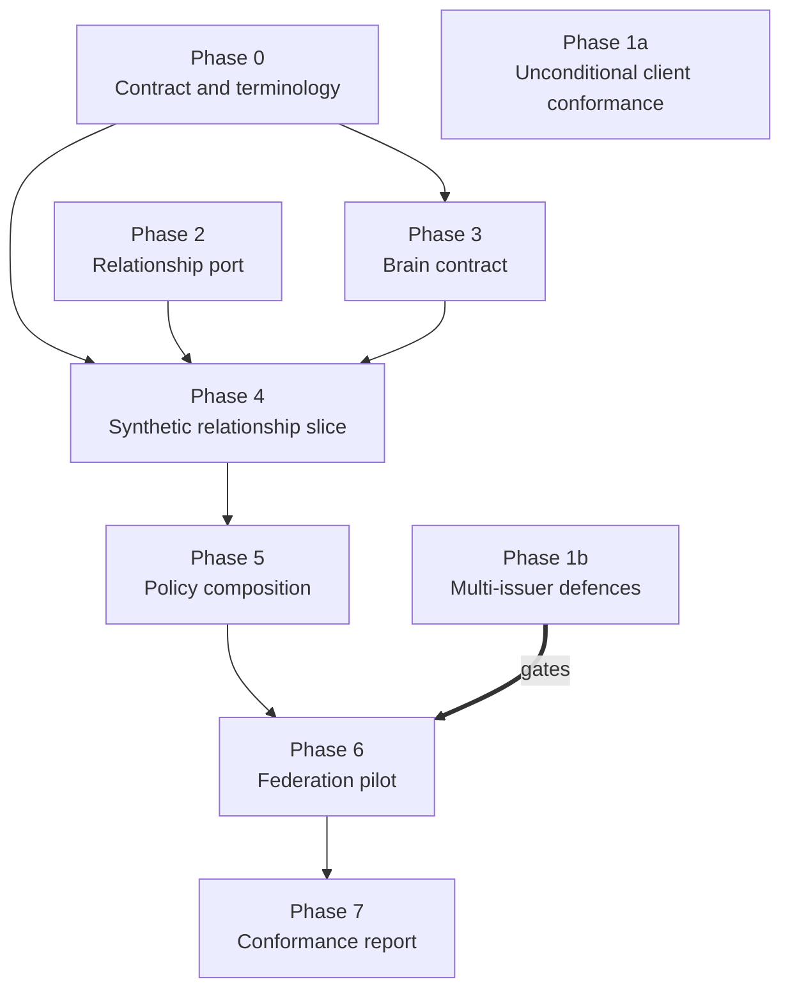

# Governed Brain — Long-Term Implementation Plan

**Status:** Proposed · **Date:** 2026-09-15 · **Depends on:** [Concepts](governed-brain-concepts.md) · [Authorization model](governed-brain-authorization.md)

This sequences the governed-brain work across the workspace's repositories. It
is a plan, not a commitment to dates, and nothing here authorizes a production
or regulated-data deployment.

The ordering principle: **the brain cannot be safer than the protocol layer
underneath it.** Several security-normative gaps in the client libraries are
prerequisites, not parallel work. Federation across issuers is the first place
those gaps become exploitable, so they gate the federation phase specifically.

## Where each piece lands

| Layer | Repository | Role in the brain |
|---|---|---|
| Protocol clients and verification | `identity-model` (`py-identity-model` locally) | Issuer, key, token, audience, sender-proof, callback, and exchange behavior — the evidence the brain's first invariant term depends on |
| Canonical identity and tenancy | `identity-stack` | Canonical subject, tenant assignment, provider links — the inputs to actor and tenant terms |
| Relationship-authorization port | `identity-stack` | The provider-neutral port; relationship engine stays external and proxied |
| Relationship engine | External (OpenFGA or equivalent) | Answers relationship questions only |
| Brain contract, grants, provenance, receipts, federation | New — not yet homed | Everything the identity layer deliberately does not own |
| Provider infrastructure | `terraform-provider-descope` | Unaffected; a brain does not change provider configuration surface |

The identity libraries stay product-neutral throughout. No brain vocabulary —
scope, grant, receipt, promotion, federation — enters them.

## Phases

### Phase 0 — Contract and terminology

No code. Establishes the vocabulary everything downstream compiles against.

- Ratify the brain, resource, grant, action, and purpose vocabulary.
- Register `brain_access` as a versioned authorization-detail schema.
- Decide whether `data_subject` travels inside authorization details or a
  separate signed grant object.
- Document issuer, subject-mapping, actor-chain, and source-authority rules.
- Define machine-readable denial reason codes and correlation fields.
- Add the new terms to [the glossary](glossary.md).

**Done when:** a reviewer can read the vocabulary and the `brain_access` schema
and describe a denial without reading either design document.

### Phase 1 — Close the security-normative client gaps

Lands in `identity-model`. These are the prerequisites named in the
authorization model's reuse order, and they are already the subject of
[Epic 24](../_bmad-output/planning-artifacts/epics/epic-24-identity-capability-gaps.md).

They divide by whether the requirement is conditional on how many issuers are in
play, and that division decides what gates what.

**Phase 1a — unconditional client conformance.** Required with a single issuer,
so nothing here should wait on a federation decision.

- `state` — or PKCE, or the OpenID Connect `nonce` — binding the callback to the
  user-agent session. This is CSRF protection (RFC 9700 §4.7), a single-issuer
  control. Needs a callback builder/parser surface in Go and Rust.
- Discovery metadata validation: the `issuer` returned MUST be identical to the
  issuer identifier the well-known URI was built from, and the response MUST NOT
  be used otherwise (RFC 8414 §3.3). Unconditional, with explicit alias and
  loopback exceptions.
- Bounded discovery and JWKS caches; single-flight fetch, including Rust's
  missing concurrent-fetch deduplication. Availability and resource hygiene,
  with no multi-issuer precondition.
- Published cache staleness and failure semantics.

**Phase 1b — multi-issuer defences.** Exploitable only once a second
authorization server is in the picture.

- Callback `iss` validation (RFC 9207) against authorization-response mix-up.
  The attack's stated preconditions require multiple authorization servers, one
  of them attacker-operated (RFC 9700 §4.4.1).
- Distinct redirect URIs per issuer are the alternative mix-up defence
  (RFC 9700 §4.4.2.2), which that section says to use only where `iss` is not
  available.

**Done when:** executable vectors for each behavior pass in every supported
language, including the negative cases. **Gates:** Phase 1b gates Phase 6.
Phase 1a gates nothing, and should not wait for it.

### Phase 2 — Relationship-authorization port

Lands in `identity-stack`. The gap analysis already defines this boundary; this
phase builds it.

- Implement `RelationshipAuthorizationPort` with typed request and result
  classes, model/version handling, and fail-closed adapter behavior.
- Wire one engine adapter behind it.
- Prove route handlers never reach the engine API directly.

**Done when:** the port is the only path to a relationship decision, and a
forced adapter timeout, unknown model, or ambiguous subject denies.

### Phase 3 — Brain contract

First artifacts of the brain itself.

- Versioned JSON Schema / OpenAPI for `BrainDescriptor`, `FederationRequest`,
  `FederationResponse`, grants, receipts, and denial categories.
- Contract linting in CI, with compatibility checks on change.
- Capability-status reporting per BR-REQ-16 from the start, so partial support
  is never reported as complete.

**Done when:** the schemas lint clean, version deliberately, and a conformance
report can be generated mechanically.

### Phase 4 — Synthetic relationship slice

- Model organization, brain, collection, record, user, service, agent, and grant
  relationships.
- Prove model compilation, tuple writes, check semantics, consistency choice,
  schema versioning, and fail-closed behavior.
- Prove the negative cases: cross-tenant, direct share, inherited membership,
  revocation, maker-checker, proposer-approver separation.
- Synthetic fixtures only.

**Done when:** a relationship decision is demonstrably *necessary but not
sufficient* for disclosure — the test that proves the layering is real.

### Phase 5 — Policy composition and the data boundary

Where the security invariant becomes executable.

- Store grants, policy versions, consent references, data labels, source
  authority, snapshot IDs, and audit decisions transactionally.
- Apply row-level security and an authorized prefilter *before* every derived
  index — search, vector, graph.
- Build the policy-composition service that intersects graph, consent, purpose,
  classification, tenant, and time.
- Test cache invalidation and queued-work cancellation on revocation.

**Done when:** every term of the invariant has an independent negative test, and
an unauthorized record is absent from every projection, export, and cache — not
merely filtered from the API response.

### Phase 6 — Federation pilot

**Gated on Phase 1b.**

- Federate two synthetic brain authorities with distinct issuers and keys.
- Exercise PAR/RAR, audience restriction, token exchange, DPoP or mTLS, local
  graph checks, policy checks, provenance, and revocation.
- Rotate keys and metadata; test clock skew, network failure, replay, retries,
  duplicate grants, and partial outage.
- Measure decision latency, cache staleness, and audit completeness before
  choosing a deployment topology.

**Done when:** a disclosure between two authorities produces a verifiable
receipt, and every failure mode above denies rather than degrades.

### Phase 7 — Conformance report

- Publish requirement-by-requirement results: implemented, partial, deferred, or
  not applicable, each with evidence.
- No phase output is described as production-ready or compliant.

## Sequencing

Phase 1 and Phase 2 are independent of each other and of Phase 0, so they can
run in parallel from the start. Only Phase 1b blocks anything downstream, and
only Phase 6. Phase 1a is baseline client conformance that is live today at a
single issuer, so it is drawn outside the gate.

### Why Phase 1 splits, and only half of it gates federation

An earlier version of this section claimed all three client-security gaps share
one property — that each is a multi-issuer bug, latent at one issuer and live at
several. That is true of one of them. The normative text says otherwise for the
other two, and the sequencing has been corrected to match.

- **Callback `iss` — genuinely multi-issuer.** Mix-up's preconditions require
  the grant to run against multiple authorization servers, one honest and one
  attacker-operated (RFC 9700 §4.4.1). With a single pinned issuer there is no
  second response to substitute. RFC 9207 is the defence, and it is fair to gate
  it on the phase that introduces a second authority.
- **`state` — single-issuer.** It is CSRF protection binding the callback to the
  user-agent session (RFC 9700 §4.7), and PKCE or `nonce` provides the same
  protection. It is live against one issuer, so it cannot sit behind a
  federation gate.
- **Discovery authority binding — unconditional.** RFC 8414 §3.3 requires the
  returned `issuer` to be identical to the issuer identifier the well-known URI
  was built from, and states that if they differ the response MUST NOT be used.
  No issuer-count precondition appears in it. The malicious-discovery-document
  class it defends against is available at one issuer.
- **Bounded JWKS caches and single-flight fetch — neither.** These are
  availability and resource-exhaustion controls. No normative text conditions
  them on issuer count, and the earlier rationale here had none.

So Phase 1a is not a federation prerequisite; it is conformance debt that is
exploitable now. Phase 1b is the part the federation pilot genuinely gates.

This still reconciles the conflict in the source material, which carried two
orderings that disagreed: a reuse order putting the client gaps first, and an
implementation sequence putting the relationship slice first and omitting the
client gaps entirely. Splitting the phase honors the reuse order's intent for
the unconditional half — these are prerequisites, not optional hardening, and
they need no federation justification — while keeping the mix-up work off the
critical path of three phases that structurally cannot trip it.

**Open — does `iss` protect Phase 6 at all?** Mix-up is an attack on
redirect-delivered authorization *responses*. The federation flow sketched in
the authorization model is broker to token-exchange to target brain, which is
back-channel. If Phase 6 never carries a front-channel authorization response
across authorities, RFC 9207 does not apply to it, and the real Phase 6
prerequisite is issuer-authority binding in the trust layer — entity statements
and signed metadata — rather than a callback parameter. Settle this before
scheduling Phase 1b: the answer either keeps the gate or moves it.

**Open — revisit when federation timing firms up.** If a second real issuer
appears before Phase 6, for a demo or a partner pilot, Phase 1b becomes the
critical path and should run strictly first. Phase 0 is the hedge: it fixes
issuer, subject-mapping, and actor-chain rules in the contract, so Phases 3–5
stay multi-issuer-aware even while implemented against one. The failure mode to
avoid is a verifier boundary with no seam for issuer-authority binding, which
would make retrofitting in Phase 6 touch everything.

## Entry points

The three smallest pieces of real work, in the order they unblock the most:

1. **Phase 0 vocabulary + `brain_access` schema** — pure writing, unblocks
   Phases 3 and 4.
2. **Phase 1a callback and discovery vectors** — already scoped under Epic 24.
   Start here rather than with `iss`: these are unconditional requirements that
   a single-issuer deployment already fails, so they pay off before any
   federation decision is made.
3. **Phase 2 port skeleton with a fail-closed adapter** — small, and it proves
   the boundary before any brain object exists.

## Known blockers

Distinct from the open decisions below: these are places where the plan as
written cannot be executed, found by the 2026-09-15 research passes
([synthesis](../_bmad-output/planning-artifacts/research/governed-brain-research-2026-09-15.md)).
None is resolved here. The plan should not be labelled ready to start on the
affected phases until each has an answer.

| Blocker | Phase | Why it blocks |
|---|---|---|
| No engine offers a safe bulk authorization filter | 5 | The data boundary assumes authorization can narrow the candidate set at scale. Relationship-authorization engines either have no list operation, truncate results silently, or advise in their own documentation against using the list operation for access-control decisions. The field's answer is a change-stream-fed projection that may only ever narrow — a layer this plan does not have |
| Nothing makes a receipt verifiable | 6 | Phase 6's done-when requires a *verifiable* receipt, and no requirement in the concepts document obliges verifiability by anyone other than the operator holding the record |
| The relationship port cannot express its own consistency guarantee | 2, 4 | A scalar consistency value cannot abstract over engines whose contracts differ, and at least one engine declares consistency fields it does not implement. The freshness token is a two-sided protocol — a write-time check returning a token stored atomically with the content — so a port offering only `check()` cannot carry it, and the "stale permission survives revocation" negative test cannot pass |
| `brain_access` defines no comparison algorithm | 0 | The RAR specification delegates comparison to the type definition. Without one, an authorization server cannot decide when an existing grant covers a new request and when re-consent is required |

A fifth finding is not a blocker but changes what can be claimed: **purpose can
be declared, bounded, and recorded, but never proven.** Authorization engines
have no cryptographic primitives for it, and the general access-control
literature places attribute truthfulness outside the engine. Treat a purpose as
an attested input recorded in the receipt, gate who may declare which purpose,
and treat absence as deny.

## Deliberately not decided

- the wire format and cryptographic envelope for federation;
- discovery trust roots and cross-organization key lifecycle;
- the first deployment stage and provider;
- the credential verifier, status mechanism, and issuer registry;
- the exact relationship model and whether the engine is hosted, self-managed,
  or replaced;
- retention classes, cache and backup deletion, and legal-hold behavior;
- durable workflow engine, graph engine, and vector/search extraction point; and
- quantitative availability, latency, result-size, cost, and revalidation
  guarantees.

These are implementation decisions to make after the abstract requirements, the
threat model, and the synthetic conformance tests are accepted.
