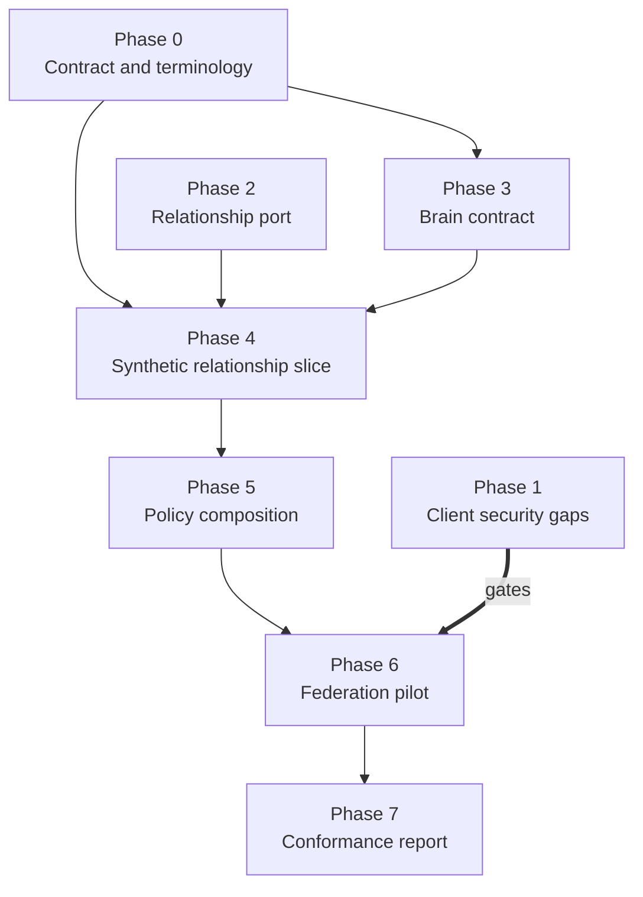

# Governed Brain — Long-Term Implementation Plan

**Status:** Proposed · **Date:** 2026-09-15 · **Depends on:** [Concepts](governed-brain-concepts.md) · [Authorization model](governed-brain-authorization.md)

This sequences the governed-brain work across the workspace's repositories. It
is a plan, not a commitment to dates, and nothing here authorizes a production
or regulated-data deployment.

The ordering principle: **the brain cannot be safer than the protocol layer
underneath it.** Several security-normative gaps in the client libraries are
prerequisites, not parallel work. Federation across issuers is the first place
those gaps become exploitable, so they gate the federation phase specifically.

## Where each piece lands

| Layer | Repository | Role in the brain |
|---|---|---|
| Protocol clients and verification | `identity-model` (`py-identity-model` locally) | Issuer, key, token, audience, sender-proof, callback, and exchange behavior — the evidence the brain's first invariant term depends on |
| Canonical identity and tenancy | `identity-stack` | Canonical subject, tenant assignment, provider links — the inputs to actor and tenant terms |
| Relationship-authorization port | `identity-stack` | The provider-neutral port; relationship engine stays external and proxied |
| Relationship engine | External (OpenFGA or equivalent) | Answers relationship questions only |
| Brain contract, grants, provenance, receipts, federation | New — not yet homed | Everything the identity layer deliberately does not own |
| Provider infrastructure | `terraform-provider-descope` | Unaffected; a brain does not change provider configuration surface |

The identity libraries stay product-neutral throughout. No brain vocabulary —
scope, grant, receipt, promotion, federation — enters them.

## Phases

### Phase 0 — Contract and terminology

No code. Establishes the vocabulary everything downstream compiles against.

- Ratify the brain, resource, grant, action, and purpose vocabulary.
- Register `brain_access` as a versioned authorization-detail schema.
- Decide whether `data_subject` travels inside authorization details or a
  separate signed grant object.
- Document issuer, subject-mapping, actor-chain, and source-authority rules.
- Define machine-readable denial reason codes and correlation fields.
- Add the new terms to [the glossary](glossary.md).

**Done when:** a reviewer can read the vocabulary and the `brain_access` schema
and describe a denial without reading either design document.

### Phase 1 — Close the security-normative client gaps

Lands in `identity-model`. These are the prerequisites named in the
authorization model's reuse order, and they are already the subject of
[Epic 24](../_bmad-output/planning-artifacts/epics/epic-24-identity-capability-gaps.md).

- Callback `iss` (RFC 9207) and `state` validation, with a callback
  builder/parser surface in Go and Rust.
- Discovery endpoint-authority binding, with explicit alias and loopback
  exceptions.
- Bounded discovery and JWKS caches; single-flight fetch, including Rust's
  missing concurrent-fetch deduplication.
- Published cache staleness and failure semantics.

**Done when:** executable vectors for each behavior pass in every supported
language, including the negative cases. **Gates:** Phase 6.

### Phase 2 — Relationship-authorization port

Lands in `identity-stack`. The gap analysis already defines this boundary; this
phase builds it.

- Implement `RelationshipAuthorizationPort` with typed request and result
  classes, model/version handling, and fail-closed adapter behavior.
- Wire one engine adapter behind it.
- Prove route handlers never reach the engine API directly.

**Done when:** the port is the only path to a relationship decision, and a
forced adapter timeout, unknown model, or ambiguous subject denies.

### Phase 3 — Brain contract

First artifacts of the brain itself.

- Versioned JSON Schema / OpenAPI for `BrainDescriptor`, `FederationRequest`,
  `FederationResponse`, grants, receipts, and denial categories.
- Contract linting in CI, with compatibility checks on change.
- Capability-status reporting per BR-REQ-16 from the start, so partial support
  is never reported as complete.

**Done when:** the schemas lint clean, version deliberately, and a conformance
report can be generated mechanically.

### Phase 4 — Synthetic relationship slice

- Model organization, brain, collection, record, user, service, agent, and grant
  relationships.
- Prove model compilation, tuple writes, check semantics, consistency choice,
  schema versioning, and fail-closed behavior.
- Prove the negative cases: cross-tenant, direct share, inherited membership,
  revocation, maker-checker, proposer-approver separation.
- Synthetic fixtures only.

**Done when:** a relationship decision is demonstrably *necessary but not
sufficient* for disclosure — the test that proves the layering is real.

### Phase 5 — Policy composition and the data boundary

Where the security invariant becomes executable.

- Store grants, policy versions, consent references, data labels, source
  authority, snapshot IDs, and audit decisions transactionally.
- Apply row-level security and an authorized prefilter *before* every derived
  index — search, vector, graph.
- Build the policy-composition service that intersects graph, consent, purpose,
  classification, tenant, and time.
- Test cache invalidation and queued-work cancellation on revocation.

**Done when:** every term of the invariant has an independent negative test, and
an unauthorized record is absent from every projection, export, and cache — not
merely filtered from the API response.

### Phase 6 — Federation pilot

**Gated on Phase 1.**

- Federate two synthetic brain authorities with distinct issuers and keys.
- Exercise PAR/RAR, audience restriction, token exchange, DPoP or mTLS, local
  graph checks, policy checks, provenance, and revocation.
- Rotate keys and metadata; test clock skew, network failure, replay, retries,
  duplicate grants, and partial outage.
- Measure decision latency, cache staleness, and audit completeness before
  choosing a deployment topology.

**Done when:** a disclosure between two authorities produces a verifiable
receipt, and every failure mode above denies rather than degrades.

### Phase 7 — Conformance report

- Publish requirement-by-requirement results: implemented, partial, deferred, or
  not applicable, each with evidence.
- No phase output is described as production-ready or compliant.

## Sequencing

Phase 1 and Phase 2 are independent of each other and of Phase 0, so they can
run in parallel from the start. Phase 1 does not block Phases 3–5; it blocks
only federation.

### Why Phase 1 is parallel, not first

The three client-security gaps share one property: each is a **multi-issuer**
bug — latent at one issuer, live at several.

- Callback `iss`/`state` defends against authorization-response mix-up. With one
  issuer there is no second response to substitute.
- Discovery authority binding matters when metadata is fetched from a party
  trusted only conditionally. A pinned single issuer never does that.
- Bounded JWKS caches and single-flight fetch address growth and duplicate
  fetches keyed by issuer count; one issuer means one cache entry.

Phases 3–5 cannot exercise any of them. Phase 3 is schemas, Phase 4 is
relationship tuples with no OAuth in the path, and Phase 5 runs against at most
one synthetic issuer. Phase 6 introduces two authorities with distinct issuers
and keys, which triggers all three at once — so the gate belongs on Phase 6
alone.

This also reconciles a conflict in the source material, which carried two
orderings that disagreed: a reuse order putting the client gaps first and the
relationship adapter fourth, and an implementation sequence putting the
relationship slice first and omitting the client gaps entirely. Treating them as
a parallel track with a federation gate honors the reuse order's intent — that
these are prerequisites, not optional hardening — without blocking three phases
that structurally cannot trip the bugs.

**Open — revisit when federation timing firms up.** If a second real issuer
appears before Phase 6, for a demo or a partner pilot, Phase 1 becomes the
critical path and should run strictly first. Phase 0 is the hedge: it fixes
issuer, subject-mapping, and actor-chain rules in the contract, so Phases 3–5
stay multi-issuer-aware even while implemented against one. The failure mode to
avoid is a verifier boundary with no seam for issuer-authority binding, which
would make retrofitting in Phase 6 touch everything.

## Entry points

The three smallest pieces of real work, in the order they unblock the most:

1. **Phase 0 vocabulary + `brain_access` schema** — pure writing, unblocks
   Phases 3 and 4.
2. **Phase 1 callback `iss`/`state` vectors** — already scoped under Epic 24,
   and the single highest-severity gap on the federation path.
3. **Phase 2 port skeleton with a fail-closed adapter** — small, and it proves
   the boundary before any brain object exists.

## Deliberately not decided

- the wire format and cryptographic envelope for federation;
- discovery trust roots and cross-organization key lifecycle;
- the first deployment stage and provider;
- the credential verifier, status mechanism, and issuer registry;
- the exact relationship model and whether the engine is hosted, self-managed,
  or replaced;
- retention classes, cache and backup deletion, and legal-hold behavior;
- durable workflow engine, graph engine, and vector/search extraction point; and
- quantitative availability, latency, result-size, cost, and revalidation
  guarantees.

These are implementation decisions to make after the abstract requirements, the
threat model, and the synthetic conformance tests are accepted.
