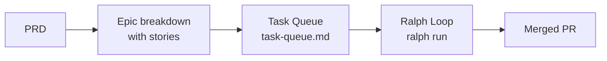
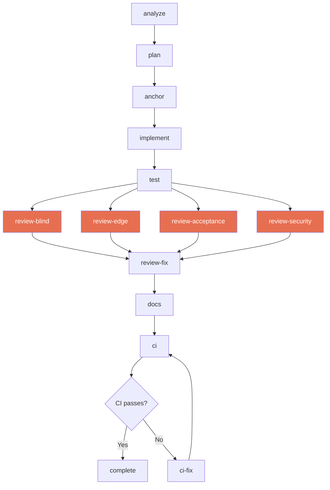
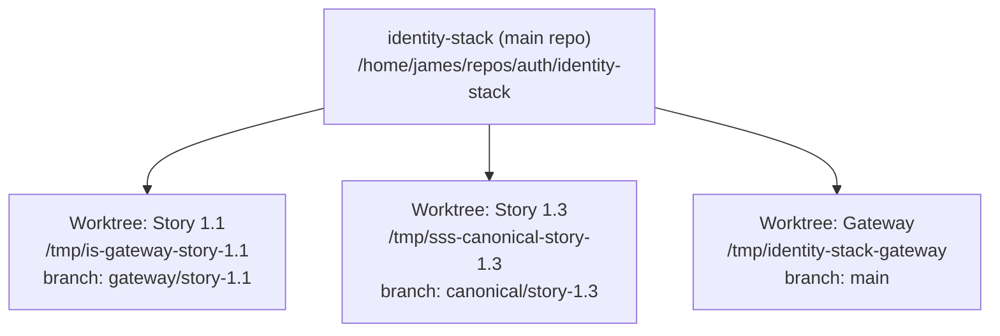
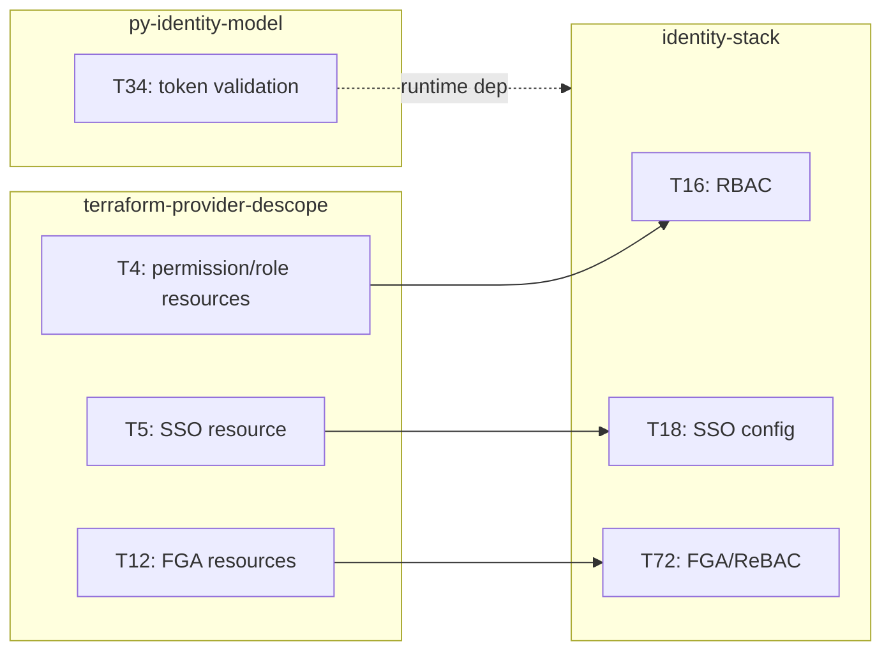

# Ralph Loop Process

This document describes how autonomous task execution works in the auth workspace using Ralph Orchestrator, from story planning through merged PR.

## Overview

A ralph loop is an autonomous execution cycle that takes a task from the queue, implements it through a multi-phase pipeline, reviews it with independent agents, and delivers a PR. Each iteration completes one phase, persists state to disk, and exits — allowing crash recovery, manual inspection, and fresh context on every phase.



## From Planning to Execution

### 1. PRD defines the initiative

A Product Requirements Document specifies functional requirements, non-functional requirements, user journeys, and success criteria. Created via `/bmad-create-prd` or `/bmad-pm`.

### 2. Architecture documents the design

Architecture decisions (ADRs), component diagrams, data models, and interface contracts. Created via `/bmad-create-architecture` or `/bmad-architect`.

### 3. Epics break work into stories

Each story has a title, acceptance criteria, and dependency information. Created via `/bmad-create-epics-and-stories`.

### 4. Stories enter the task queue

The task queue (`_bmad-output/implementation-artifacts/task-queue.md`) is the single source of truth for all work across all repos. Each task has:

| Field | Description |
|-------|-------------|
| ID | Unique task identifier (T1, T2, ...) |
| Issue | GitHub issue number |
| Status | `pending` / `in_progress` / `done` / `blocked` / `wontfix` |
| Description | What the task implements |
| Branch | Git branch name |
| Iterations | Effort size estimate |
| Depends On | Task IDs that must complete first |

### 5. Ralph loop picks up the task

A ralph prompt file reads the queue, finds the next `pending` task whose dependencies are all `done`, and begins execution.

## The Phase Pipeline

Each ralph iteration completes exactly one phase, then exits. The next iteration reads the task-state file and continues from where it left off.

### Feature Task Phases



| Phase | What Happens | Agent/Persona |
|-------|-------------|---------------|
| **analyze** | Read story spec, acceptance criteria, and related code. Identify scope and dependencies. | Winston (Architect) |
| **plan** | Create detailed implementation plan: files to create/modify, AC-to-code mapping, edge cases. | Winston (Architect) |
| **anchor** | Verify the plan matches actual file contents. Read every file mentioned in the plan and confirm the codebase state matches expectations. Halt on mismatch. | Amelia (Developer) |
| **implement** | Write the code according to the plan. Follow existing patterns, conventions, and CLAUDE.md instructions. | Amelia (Developer) |
| **test** | Write and run tests. Unit tests for all new code, integration tests where applicable. All tests must pass with 80%+ coverage. | Quinn (QA) |
| **review-blind** | Independent Blind Hunter review (diff only, fresh context). | Blind Hunter subagent |
| **review-edge** | Independent Edge Case Hunter review (diff + repo access, fresh context). | Edge Case Hunter subagent |
| **review-acceptance** | Independent Acceptance Auditor review (spec + repo access, fresh context). | Acceptance Auditor subagent |
| **review-security** | Independent Sentinel review (security lens, fresh context). Conditional Viper red team for auth changes. | Sentinel subagent |
| **review-fix** | Triage all findings by priority. Fix blocking issues. Re-review. Max 3 iterations. | Amelia (Developer) |
| **docs** | Update documentation if the story requires it. | Paige (Tech Writer) |
| **ci** | Push branch, create PR, wait for CI checks. | Automated |
| **ci-fix** | If CI fails: diagnose, fix, re-push, re-wait. | Amelia (Developer) |
| **complete** | Mark task done in queue, delete task-state file, clean up worktree. | Automated |

### Fix Task Phases

Fix tasks (review finding fixes for existing PRs) use a shorter pipeline:

```
checkout → fix → test → review-blind → review-edge → review-security → review-fix → ci → complete
```

No analyze/plan/anchor phases — the fix scope is already defined by the review findings.

### Story Loop Phases

Story-based loops (e.g., canonical identity) add worktree management:

```
setup → analyze → anchor → implement → test → review → review-fix → pr → ci → ci-fix → complete
```

The `setup` phase creates an isolated git worktree. The `complete` phase cleans it up.

## Task-State Persistence

Every phase writes its output to `.claude/task-state.md` in the target repo. This file is the loop's memory between iterations.

**Example task-state file:**

```yaml
story: 1.3
issue: 140
branch: canonical/story-1.3-error-model-result-types
base_branch: canonical/story-1.2-alembic-schema
worktree: /tmp/sss-canonical-story-1.3
phase: implement
```

Below the metadata header, the file accumulates section content as phases complete:

```markdown
## Plan
### Files to Create
1. backend/app/errors/identity.py — IdentityError hierarchy
2. backend/app/errors/problem_detail.py — RFC 9457 response model
...

## Review: Blind Hunter
### MUST FIX
- [backend/app/errors/problem_detail.py:45] ...

## Review: Security (Sentinel)
### BLOCK
(none)
### WARN
- [UNLIKELY] ...
```

**Key properties:**
- One task-state file per active loop (multiple files = parallel loops)
- Named variants for parallel loops: `task-state.md`, `task-state-gateway.md`, `task-state-secrets.md`
- File is deleted on successful completion
- If the file exists but ralph isn't running, the loop is paused/crashed — restart with `ralph run` to resume

## Worktree Isolation

Story-based loops create isolated git worktrees so multiple stories can execute in parallel without filesystem conflicts.



**Lifecycle:**
1. **Setup:** `git worktree add /tmp/<name> -b <branch> origin/<base-branch>`
2. **All phases** execute in the worktree directory (not the main repo)
3. **Complete:** `git worktree remove /tmp/<name>`

**Benefits:**
- Multiple stories run in parallel without conflict
- Clean branch state (no stale files from other work)
- Easy recovery if a loop crashes (worktree is self-contained)
- Main repo stays on its own branch undisturbed

## Running a Ralph Loop

### Prerequisites

- [Ralph Orchestrator](https://github.com/mikeyobrien/ralph-orchestrator) installed
- `ralph.yml` in the target repo (already present in identity-stack and py-identity-model)
- A ralph prompt file copied to `PROMPT.md` in the target repo

### Starting a loop

```bash
# Navigate to the target repo
cd ~/repos/auth/identity-stack

# Copy the appropriate prompt
cp ~/repos/auth/auth-planning/_bmad-output/implementation-artifacts/ralph-prompts/canonical-identity.md PROMPT.md

# Start the loop
ralph run
```

### Monitoring

```bash
# Current phase and task
cat .claude/task-state.md | head -10

# Full task state with review findings
cat .claude/task-state.md

# List active worktrees
git worktree list

# Check from any repo using the skill
/ralph-status
```

### Available Prompts

| Prompt | Purpose | Target Repos |
|--------|---------|-------------|
| `run-next-task.md` | General task execution from queue | All 3 repos |
| `fix-review-findings.md` | Fix review findings on existing PRs | All 3 repos |
| `canonical-identity.md` | PRD 5 story execution (worktree-based) | identity-stack |
| `api-gateway.md` | PRD 2 story execution (worktree-based) | identity-stack |
| `pim-integration-tests.md` | Integration test chain | py-identity-model |
| `pim-fix-review-chain.md` | Chained PR fix loop | py-identity-model |
| `pim-adversarial-review.md` | Full codebase security review | py-identity-model |
| `epic2-rbac-admin.md` | RBAC admin epic (completed) | identity-stack |
| `epic3-fga-authz.md` | FGA/ReBAC epic (completed) | identity-stack |

### Stopping a loop

Ralph loops can be stopped between iterations (each iteration is a clean exit point). Cancel the ralph process — the task-state file persists so the loop can resume.

### Adjusting the queue

Edit `_bmad-output/implementation-artifacts/task-queue.md` to:
- Reorder tasks (ralph picks the first pending task with met dependencies)
- Skip tasks (change status to `wontfix`)
- Add new tasks
- Change dependencies

## Cross-Repo Dependencies

The task queue tracks dependencies across repos:



Ralph loops running in different repos respect these dependencies — a task won't be picked up if its cross-repo dependency is still pending.

## Iteration Model

Each ralph invocation runs **one phase per iteration**, then exits cleanly:

```
Iteration 1:  Read queue → Pick task → analyze phase → write state → exit
Iteration 2:  Read state → plan phase → update state → exit
Iteration 3:  Read state → anchor phase → update state → exit
Iteration 4:  Read state → implement phase → update state → exit
...
Iteration N:  Read state → ci passes → mark done → delete state → exit
Next task:    No state file → Read queue → Pick next task → repeat
```

**Why this design:**
- **Fresh context** each iteration prevents prompt bloat and hallucination drift
- **State on disk** enables crash recovery (just restart `ralph run`)
- **Manual inspection** between phases — read task-state to see what happened
- **Phase isolation** — implementation context doesn't leak into review context

## Configuration

Each application repo has a `ralph.yml`:

```yaml
backend: claude
timeout: 900          # 15 minutes per iteration
event_loop:
  prompt_file: PROMPT.md
  completion_promise: LOOP_COMPLETE
  max_iterations: 100
  max_consecutive_failures: 10
```

| Field | Description |
|-------|-------------|
| `backend` | AI backend (always `claude` for this workspace) |
| `timeout` | Maximum seconds per iteration |
| `prompt_file` | Entry point prompt (copied from ralph-prompts/) |
| `completion_promise` | String that signals the loop is done |
| `max_iterations` | Safety limit on total iterations |
| `max_consecutive_failures` | Stop if this many iterations fail in a row |
