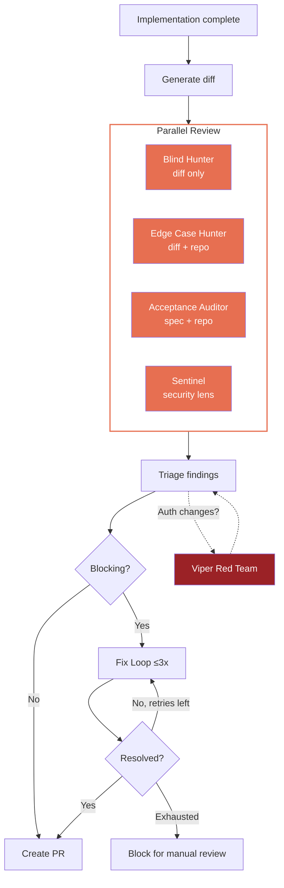

# Code Review Process

This document describes how code quality is enforced across the auth workspace using independent review agents.

## Why Independent Review Contexts

The auth workspace uses AI-driven development loops (Ralph Orchestrator) to implement features autonomously. Early on, code reviews were performed within the same conversation context as the implementation — the reviewer had already "seen" the code it wrote and was biased toward confirming its own work.

**The result:** Reviews were shallow. They found surface-level style issues but missed real bugs, security vulnerabilities, and logic errors. PRs #178-181 in identity-stack demonstrated the problem: reviews passed, but independent re-review found dozens of genuine issues including cross-tenant IDOR vulnerabilities, privilege escalation paths, and resource leaks.

**The fix:** Each reviewer runs in a completely fresh context with zero access to the implementation plan, task-state, or conversation history. They read the code cold.

## Review Agent Personas

Five specialized reviewers, each designed to catch a different class of defects:

### Blind Hunter

**Mindset:** Cynical, jaded, expects problems. Zero project context — sees only the diff.

**What it catches:**
- Logic errors (off-by-one, inverted conditions, wrong operator)
- Missing error handling (swallowed exceptions, unhandled I/O)
- Security vulnerabilities (injection, auth bypass, credential exposure)
- API contract violations (wrong status codes, missing fields)
- Race conditions (TOCTOU, concurrent access without locks)
- Dead code (unused imports, unreachable branches)
- Resource leaks (unclosed connections, missing cleanup in error paths)

**Output format:** MUST FIX (blocks merge) / SHOULD FIX (quality risk) / NITPICK (style only)

**Template:** [`review-agents/blind-hunter.md`](../_bmad-output/implementation-artifacts/ralph-prompts/review-agents/blind-hunter.md)

### Edge Case Hunter

**Mindset:** Pure path tracer. Methodical, exhaustive, emotionless. Walks every branch.

**What it catches:**
- Unhandled branching paths (if/else, try/except, early returns)
- Domain boundary violations (null, empty, zero-length, negative, max int)
- Async gaps (unhandled exceptions in awaited calls, missing timeouts)
- Type boundary misses (Optional not checked, dict key misses, list index errors)
- Integration boundary failures (HTTP timeouts, empty DB results, service outages)

**Output format:** Table with location, trigger condition, guard snippet, and consequence severity ([CRASH] / [DATA] / [WRONG] / [DEGRADED])

**Template:** [`review-agents/edge-case-hunter.md`](../_bmad-output/implementation-artifacts/ralph-prompts/review-agents/edge-case-hunter.md)

### Acceptance Auditor

**Mindset:** Literal, unforgiving contract lawyer. Checks every acceptance criterion.

**What it catches:**
- Missing implementations (AC specified but not coded)
- Missing tests (AC implemented but not verified)
- Implementation drift (code does something different than the AC intended)
- Scope creep (code added beyond what the AC requires)
- Architecture violations (patterns that contradict documented decisions)

**Output format:** PASS / FAIL / PARTIAL / SCOPE CREEP per acceptance criterion. FAIL and unresolved PARTIAL block merge.

**Template:** [`review-agents/acceptance-auditor.md`](../_bmad-output/implementation-artifacts/ralph-prompts/review-agents/acceptance-auditor.md)

### Sentinel (Security Auditor)

**Mindset:** Pragmatic, experienced, calibrated. Reports only genuinely exploitable vulnerabilities. Never cries wolf.

**What it catches:**
- Tenant isolation failures (tenant A accessing tenant B's data)
- Authorization bypass (non-admin reaching admin endpoints, fail-open defaults)
- Injection (SQL, command, template, header)
- Authentication integrity gaps (JWT validation, token confusion, issuer validation)
- Credential exposure (secrets in logs, error responses, version control)
- SSRF (user-controlled URLs reaching backend HTTP clients)
- Sync/ordering issues (partial failures leaving inconsistent auth state)

**Output format:** BLOCK (CONFIRMED/LIKELY — must include concrete attack scenario) / WARN (LIKELY/UNLIKELY) / INFO (acceptable risk). Overall: PASS or FAIL.

**Template:** [`review-agents/sentinel.md`](../_bmad-output/implementation-artifacts/ralph-prompts/review-agents/sentinel.md)

### Viper (Red Team)

**Mindset:** Offensive security specialist. Activated only for high-risk changes.

**Trigger:** Changes touching auth middleware, token validation, JWT handling, infrastructure config, or security-sensitive code.

**What it does (3-stage pipeline):**
1. **Recon** — Map the attack surface from the diff: authentication boundaries, authorization checks, data flows, external inputs
2. **Vulnerability Analysis** — Probe for: auth bypass, privilege escalation, injection chains, token confusion, IDOR, middleware ordering exploits, infrastructure escape
3. **Exploit Validation** — For each finding: concrete step-by-step exploitation, prerequisites, CVSS v3.1 scoring

**Output format:** CRITICAL / HIGH / MEDIUM / LOW with attack scenarios, prerequisites, CVSS scores, and remediation steps.

**Template:** [`review-agents/viper.md`](../_bmad-output/implementation-artifacts/ralph-prompts/review-agents/viper.md)

## Review Flow in Ralph Loops

**Key properties:**
- All 4 standard reviewers run in parallel (no shared context between them)
- Viper is conditional — only triggered for auth/middleware/token/infrastructure changes
- Each reviewer is a separate Claude Code subagent spawned with a fresh context
- The fix loop re-reviews ALL findings after fixes (not just the ones that were "fixed")
- Blocking findings that survive 3 fix iterations require manual intervention

## Finding Severity Triage

When multiple reviewers report overlapping findings, the review-fix phase triages by priority:

1. **BLOCK / CONFIRMED** (Sentinel) — Exploitable security vulnerabilities
2. **FAIL** (Acceptance Auditor) — Missing or incorrect requirements implementation
3. **MUST FIX** (Blind Hunter) — Bugs, crashes, data loss
4. **CRITICAL / HIGH** (Viper) — Red team exploitation paths
5. **Edge cases with [CRASH] or [DATA]** (Edge Case Hunter) — Unhandled paths causing crashes or data loss
6. **WARN / LIKELY** (Sentinel) — Security issues requiring unusual conditions
7. **SHOULD FIX** (Blind Hunter) — Code quality risks
8. **PARTIAL** (Acceptance Auditor) — Incomplete implementations
9. **Edge cases with [WRONG] or [DEGRADED]** (Edge Case Hunter) — Incorrect results or degraded behavior
10. **NITPICK / INFO** — Deferred unless trivial to fix

## Manual Adversarial Review

For full codebase re-reviews outside of ralph loops (e.g., when prior in-context reviews were shallow), use the standalone adversarial review prompt:

**py-identity-model:** [`pim-adversarial-review.md`](../_bmad-output/implementation-artifacts/ralph-prompts/pim-adversarial-review.md)

This prompt is designed to run in a **completely fresh Claude Code session** with no prior conversation context. It covers:
1. Architectural reconnaissance (read key files to understand the codebase)
2. Red team security review (JWT attacks, OIDC exploitation, protocol flow attacks)
3. Blind code review (sync/async parity, error paths, resource lifecycle, thread safety)
4. Edge case exhaustion (boundary inputs across every public function)
5. Test coverage audit (untested attack scenarios, missing error path tests)

**To use:** Open a new Claude Code session in `~/repos/auth/py-identity-model/` and paste the prompt contents.

## Review Findings History

Past review findings are tracked in:
- [`review-findings-identity-stack.md`](../_bmad-output/implementation-artifacts/review-findings-identity-stack.md) — 44 MUST FIX, 85 SHOULD FIX, 51 DEFER across 12 PRs (all resolved)
- Individual task-state files record per-PR findings during ralph loop execution
