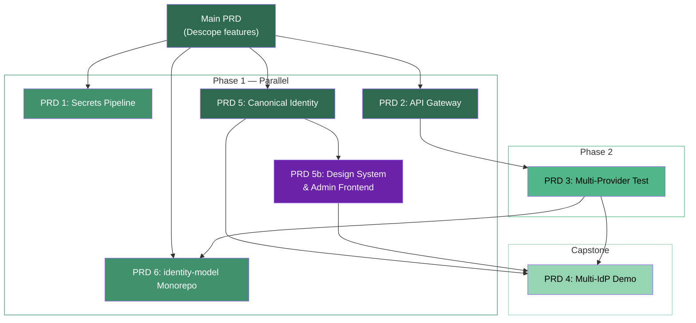

# Project Roadmap

This document is the master index for all planned work across the auth workspace. It defines PRD sequencing, cross-repo dependencies, and MVP boundaries.

## PRD Overview

| PRD | Title | Target Repos | Status | Stories |
|-----|-------|-------------|--------|---------|
| Main | Unified Identity Platform | all 3 | Active | 147+ tasks tracked |
| PRD 1 | Infrastructure Secrets Pipeline | identity-stack, terraform-provider-descope | Planned | 22 stories / 3 epics |
| PRD 2 | API Gateway & Deployment Topology | identity-stack | Done | 17 stories / 4 epics |
| PRD 3 | Multi-Provider Test Infrastructure | py-identity-model, identity-stack | Planned | ~25 stories / 3 epics |
| PRD 4 | Multi-IdP Gateway Demo | identity-stack | Planned | ~20 stories / 4 epics |
| PRD 5 | Canonical Identity Domain Model | identity-stack | Done | 19 stories / 4 epics |
| PRD 5b | Design System & Admin Frontend | identity-stack | Active | 31 stories / 5 epics |
| PRD 6 | identity-model Multi-Language Monorepo | identity-model (new repo) | Planned | ~100 stories / 15 epics |

## Dependency Graph

**Parallel tracks:**
- PRD 1 (secrets), PRD 2 (gateway), and PRD 5 (canonical identity) can all begin independently
- PRD 3 (multi-provider test) requires PRD 2's Tyk integration for the second OIDC provider endpoint
- PRD 4 (multi-IdP demo) is the capstone — requires PRD 3's test infrastructure AND PRD 5's canonical identity model
- PRD 6 (identity-model monorepo) depends on Main PRD completion and PRD 3's shared test infrastructure

## PRD Details

### Main PRD — Unified Identity Platform

**Scope:** The umbrella PRD defining the three-repo platform vision. Covers Descope feature completion across py-identity-model (protocol library), terraform-provider-descope (IaC), and identity-stack (application).

**Functional Requirements:** 22 FRs organized by repo:
- `FR-PIM-1` through `FR-PIM-8` — py-identity-model protocol features (discovery, JWKS, token validation, auth code, DPoP, introspection, revocation, token exchange)
- `FR-TFP-1` through `FR-TFP-5` — terraform-provider-descope resources (permissions, roles, SSO, FGA, project export)
- `FR-SSS-1` through `FR-SSS-4` — identity-stack features (session mgmt, tenant admin, RBAC, access keys)
- `FR-CROSS-1` through `FR-CROSS-5` — cross-cutting (security hardening, testing, CI/CD, documentation)

**Status:** ~80% of feature tasks complete. Remaining: integration tests (py-identity-model), blocked items (enterprise license for SSO app), and documentation.

**Artifacts:**
- PRD: [`prd.md`](../_bmad-output/planning-artifacts/prd.md)
- Architecture: [`architecture.md`](../_bmad-output/planning-artifacts/architecture.md)
- Epics: [`epics.md`](../_bmad-output/planning-artifacts/epics.md)

---

### PRD 1 — Infrastructure Secrets Pipeline

**Problem:** N secrets scattered across `.env` files with no audit trail, rotation policy, or access control.

**Solution:** Three-layer pipeline using HCP Terraform (state management) + Infisical (secret storage) + Descope API (provisioning). Reduces bootstrap to 2 credentials.

**MVP scope:** HCP Terraform workspace migration, Infisical project setup, `infisical run` integration for backend and frontend, Terraform provider for writing outputs to Infisical.

**Growth scope:** Secret rotation automation, CI/CD pipeline integration, self-hosted Infisical option.

**Artifacts:**
- PRD: [`prd-infrastructure-secrets.md`](../_bmad-output/planning-artifacts/prd-infrastructure-secrets.md)
- Architecture: [`architecture-infrastructure-secrets.md`](../_bmad-output/planning-artifacts/architecture-infrastructure-secrets.md)
- Epics: [`epics-infrastructure-secrets.md`](../_bmad-output/planning-artifacts/epics-infrastructure-secrets.md)

---

### PRD 2 — API Gateway & Deployment Topology

**Problem:** Authentication (JWT validation) and rate limiting are implemented in FastAPI middleware. This works but doesn't demonstrate the progressive adoption pattern of offloading cross-cutting concerns to a gateway.

**Solution:** Integrate Tyk OSS as an optional API gateway with dual deployment modes (standalone vs gateway) toggled by `DEPLOYMENT_MODE` environment variable at startup. Docker Compose profiles control which services run.

**Key architectural boundary:**
- Tyk handles **authentication** — JWT signature verification, expiry, issuer validation
- FastAPI handles **authorization** — tenant-scoped role/permission checks against nested JWT claims

**MVP scope:** Tyk config directory, JWT validation offloading, rate limiting offloading, Docker Compose profiles, middleware factory pattern.

**Growth scope:** Claim normalization plugin, multi-provider JWT validation, analytics pipeline.

**Artifacts:**
- PRD: [`prd-api-gateway.md`](../_bmad-output/planning-artifacts/prd-api-gateway.md)
- Architecture: [`architecture-api-gateway.md`](../_bmad-output/planning-artifacts/architecture-api-gateway.md)
- Epics: [`epics-api-gateway.md`](../_bmad-output/planning-artifacts/epics-api-gateway.md)

---

### PRD 3 — Multi-Provider Test Infrastructure

**Problem:** py-identity-model integration tests run against a single OIDC provider. This doesn't validate provider-agnostic behavior or catch provider-specific assumptions.

**Solution:** Deploy node-oidc-provider as a lightweight, RFC-compliant OIDC server in Docker. Dual-purpose: test fixture for py-identity-model AND second provider for identity-stack gateway mode.

**MVP scope:** Docker image, custom claims support, py-identity-model integration test suites (discovery, JWKS, token validation, auth code + PKCE, introspection, revocation), identity-stack Tyk multi-provider config.

**Growth scope:** Custom claims plugins, multi-key JWKS rotation, Ory Hydra as third provider.

**Artifacts:**
- PRD: [`prd-multi-provider-test.md`](../_bmad-output/planning-artifacts/prd-multi-provider-test.md)
- Architecture: [`architecture-multi-provider-test.md`](../_bmad-output/planning-artifacts/architecture-multi-provider-test.md)
- Epics: [`epics-multi-provider-test.md`](../_bmad-output/planning-artifacts/epics-multi-provider-test.md)

---

### PRD 4 — Multi-IdP Gateway Demo

**Problem:** The platform is currently Descope-only. The vision is provider independence, but nothing proves the abstraction works with real providers.

**Solution:** Capstone demonstration: user authenticates with Descope, Ory Hydra, or a cloud IdP (Google, Entra, Cognito). Tyk gateway validates all JWTs, a Go plugin normalizes divergent claim structures into a canonical format, and the backend operates on normalized claims without knowing the provider.

**Key innovation:** Claim normalization plugin in Tyk that maps provider-specific JWT claims (`dct`, `tenants` for Descope; `realm_access.roles` for Ory; `groups` for Entra) into a uniform header set (`X-User-ID`, `X-User-Email`, `X-User-Roles`, `X-Tenant-ID`).

**MVP scope:** Descope + node-oidc-provider + Go claim mapper plugin + frontend provider picker + normalized backend.

**Growth scope:** Entra ID, Cognito, and Okta mappers; cloud IdP documentation; advanced claim transformation.

**Depends on:** PRD 2 (gateway), PRD 3 (second provider), PRD 5 (canonical identity for backend).

**Artifacts:**
- PRD: [`prd-multi-idp-demo.md`](../_bmad-output/planning-artifacts/prd-multi-idp-demo.md)
- Architecture: [`architecture-multi-idp-demo.md`](../_bmad-output/planning-artifacts/architecture-multi-idp-demo.md)
- Epics: [`epics-multi-idp-demo.md`](../_bmad-output/planning-artifacts/epics-multi-idp-demo.md)

---

### PRD 5 — Canonical Identity Domain Model

**Problem:** Every identity operation is a direct proxy call to Descope — the backend owns no data. Swapping providers means rewriting every endpoint. Adding a second provider means duplicating every integration.

**Solution:** Invert the architecture. The backend owns a canonical Postgres store (8 SCIM-aligned tables). Identity providers become sync targets via an adapter interface. API-originated writes go to Postgres first, then sync to the provider. Out-of-band changes (console edits, SCIM pushes) arrive via webhooks and reconciliation.

**Why it matters:** This is the architectural foundation for provider independence. Once the canonical model exists, adding a new provider means implementing one adapter — not rewriting the application.

**Epic breakdown:**
1. **Foundation** (6 stories) — Postgres, Alembic, error model, OpenTelemetry, service interfaces
2. **Identity & Access Admin** (5 stories) — User/Role/Permission/Tenant services, router rewire
3. **Inbound Sync** (4 stories) — Descope seeding, webhook handler, reconciliation, Redis cache
4. **Multi-IdP Linking** (4 stories) — Provider config, identity linking, provider management API

**Artifacts:**
- PRD: [`prd-canonical-identity.md`](../_bmad-output/planning-artifacts/prd-canonical-identity.md)
- Architecture: [`architecture-canonical-identity.md`](../_bmad-output/planning-artifacts/architecture-canonical-identity.md)
- Epics: [`epics.md`](../_bmad-output/planning-artifacts/epics.md) (PRD 5 section)

### PRD 5b — Design System & Admin Frontend

**Problem:** PRD 5 shipped the canonical identity backend (Postgres store, sync adapters, provider management), but the frontend has no admin UI for these new capabilities. The frontend also uses a default neutral grayscale palette with no brand identity.

**Solution:** Integrate a comprehensive design system (exported from Claude Design) that introduces a purple brand color, increased density for admin readability, 8 new reusable components (KPI strip, provider glyph, sparkline, stream row, sync flow, matrix grid, audit row, confidence score), responsive breakpoints (tablet + mobile), and 5 new admin pages for the PRD 5 backend.

**New admin pages:**
1. **Providers** — IdP registry with KPI strip, detail drill-down with tabs (Overview, Claim Mapping, Linked Users, Webhooks)
2. **Sync Dashboard** — 3 layout variants (flow, matrix, stack) with event stream and conflict resolution
3. **Inbound Events** — Live webhook/SCIM event tail with provider + verb filtering
4. **Identity Correlation** — Canonical user detail with multi-link management and drift detection
5. **Provisional Users** — Queue of unlinked runtime sign-ins with merge/create/reject actions

**MVP scope:** Token migration, component library, all 5 pages, responsive layout, comprehensive tests.

**Depends on:** PRD 5 backend (COMPLETE).

**Artifacts:**
- Design system reference: [`design-system/`](../_bmad-output/planning-artifacts/design-system/)
- Epics: [`epics-design-system.md`](../_bmad-output/planning-artifacts/epics-design-system.md)
- Ralph prompt: [`ralph-prompts/design-system.md`](../_bmad-output/implementation-artifacts/ralph-prompts/design-system.md)

---

### PRD 6 — identity-model Multi-Language Monorepo

**Problem:** The identity protocol client space outside of C#/.NET is fragmented. Developers in Python, Node/TypeScript, Go, and Rust must cobble together 3-4 libraries for basic OIDC/OAuth2 support. No ecosystem has a unified client library with modern RFC coverage (DPoP, PAR, RAR, Token Exchange).

**Solution:** Transform py-identity-model into a multi-language monorepo — `identity-model` — porting the design philosophy of Duende's IdentityModel (.NET) to Python, Node/TypeScript, Go, and Rust. A shared `spec/` directory defines cross-language conformance test definitions; each language implements them idiomatically.

**Scope:** 15 epics covering: monorepo setup, cross-language conformance specs, Core Tier (all 4 languages), Extended Tier (Introspection, Revocation, Token Exchange, DPoP), Advanced Tier (PAR, RAR), OpenTelemetry, security pipeline, documentation site, benchmarks, contributor DX, competitive analysis, naming/versioning, improvement spikes, and modern auth extensions.

**Depends on:** Main PRD (py-identity-model protocol features complete), PRD 3 (node-oidc-provider test infrastructure for shared conformance tests).

**Artifacts:**
- Product Brief: [`product-brief-identity-model-monorepo.md`](../_bmad-output/planning-artifacts/product-brief-identity-model-monorepo.md)
- Competitive Analysis: [`competitive-analysis-identity-model.md`](../_bmad-output/planning-artifacts/competitive-analysis-identity-model.md)
- Epics: [`epics/epic-0a-monorepo-setup.md`](../_bmad-output/planning-artifacts/epics/epic-0a-monorepo-setup.md) through [`epic-15-modern-auth-extensions.md`](../_bmad-output/planning-artifacts/epics/epic-15-modern-auth-extensions.md) (24 files)

---

## Cross-PRD Functional Requirement Mapping

The main PRD defines 22 high-level FRs. Here's how the specialized PRDs implement them:

| Main PRD FR | Description | Implemented By |
|-------------|-------------|----------------|
| FR-PIM-1..8 | Protocol features (discovery, JWKS, validation, PKCE, DPoP, etc.) | Main PRD (complete) |
| FR-TFP-1..5 | Terraform resources (permissions, roles, SSO, FGA, export) | Main PRD (complete) |
| FR-SSS-1..4 | App features (sessions, tenants, RBAC, access keys) | Main PRD (complete) |
| FR-CROSS-1 | Security hardening | Main PRD (complete) + PRD 1 (secrets) |
| FR-CROSS-2 | Testing infrastructure | PRD 3 (multi-provider test) |
| FR-CROSS-3 | CI/CD pipeline | PRD 1 (secrets) + PRD 2 (gateway profiles) |
| FR-CROSS-4 | Documentation | Main PRD (ongoing) |
| FR-CROSS-5 | Provider abstraction | PRD 5 (canonical identity) + PRD 4 (multi-IdP demo) |

## Implementation Order

**Phase 1 — DONE:**
- Main PRD: py-identity-model feature tasks, identity-stack features — all shipped
- PRD 5: Canonical identity domain model (19 stories) — shipped 2026-04-09
- PRD 2: API gateway (17 stories) — shipped 2026-04-11/12

**Phase 1b — ACTIVE (two parallel tracks):**

*Track 1: py-identity-model (certification + security + products)*
- Security re-audit Phase 2 (T200-T207) — 8 findings from 2026-04-14 re-audit
- OIDC RP Certification ([#242](https://github.com/jamescrowley321/py-identity-model/issues/242)) — Config RP (T145), fix cycle (T146), Implicit/Hybrid (T147)
- Monorepo restructure ([#332](https://github.com/jamescrowley321/py-identity-model/issues/332)) — uv workspace with member packages
- CLI tool ([#333](https://github.com/jamescrowley321/py-identity-model/issues/333)) — `py-identity-model-cli`, RFC 8252 loopback login
- FastAPI middleware ([#334](https://github.com/jamescrowley321/py-identity-model/issues/334)) — `fastapi-identity-model`, drop-in OIDC auth
- Secrets rotation automation ([#346](https://github.com/jamescrowley321/py-identity-model/issues/346)) — GH + HCP Vault Secrets sync

*Track 2: identity-stack (Design System Integration — TOP PRIORITY)*
- PRD 5b: Design System & Admin Frontend — 31 stories / 5 epics
  - DS-1: Token migration (purple brand, density, typography)
  - DS-2: Component + layout updates (responsive, sidebar nav, badge variants)
  - DS-3: 8 new shared components (KPI strip, provider glyph, sparkline, stream row, sync flow, matrix grid, audit row, confidence score)
  - DS-4: 5 new admin pages (Providers, Sync Dashboard, Events, Identity Correlation, Provisional Users)
  - DS-5: Integration testing (unit, E2E, responsive, visual regression)

*These tracks are 100% independent — different repos, zero dependency.*

**Phase 2 (parallel, after Phase 1b foundations):**
- PRD 1: Infrastructure secrets pipeline
- PRD 3: Multi-provider test infrastructure

**Phase 3 (capstone, depends on Phase 2):**
- PRD 4: Multi-IdP gateway demo (needs PRD 3 test infra + PRD 5 canonical identity + PRD 5b frontend)
- PRD 6: identity-model multi-language monorepo (depends on Main PRD + PRD 3)
