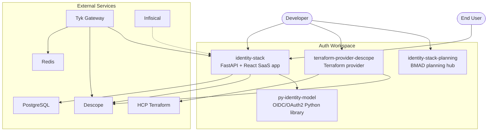
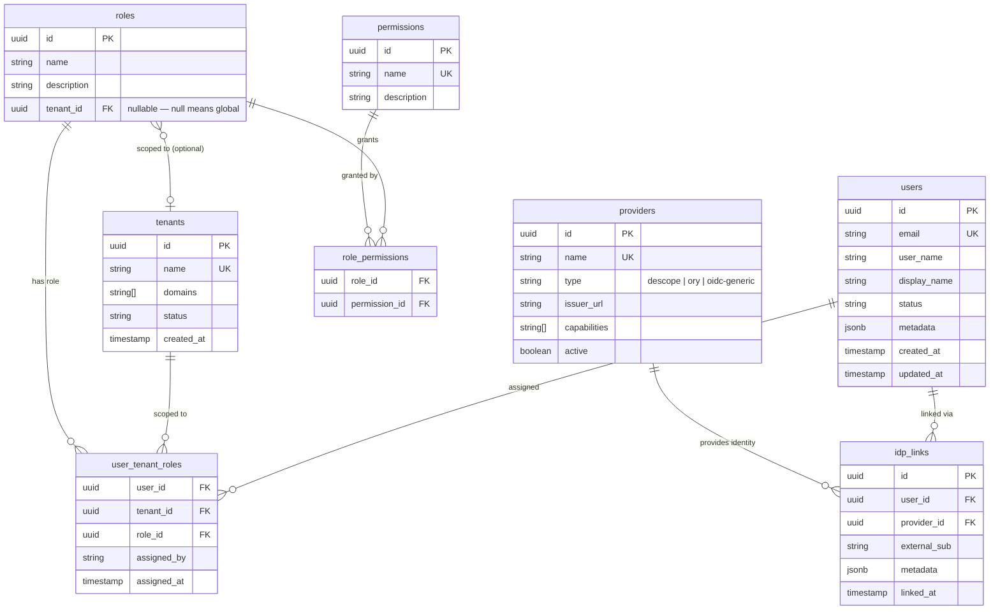
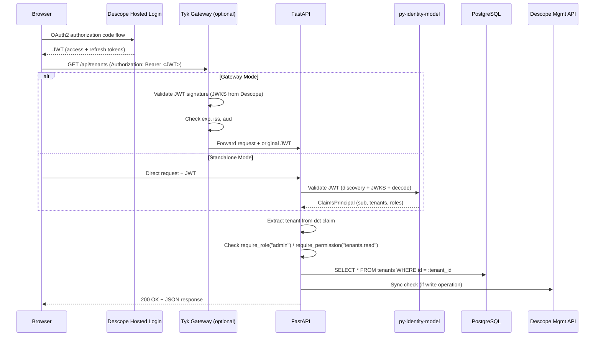
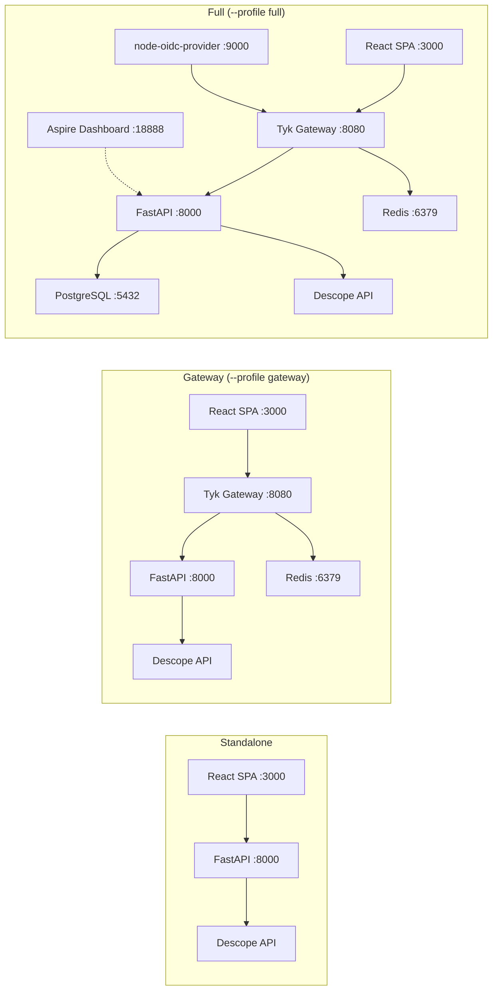
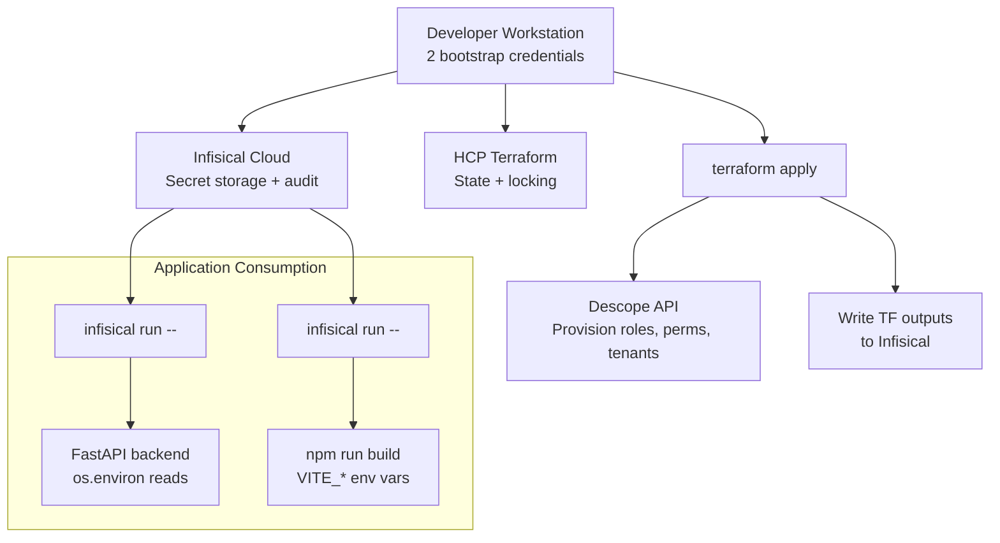

# System Architecture

Unified technical overview of the auth workspace. For detailed architecture decisions, see the per-PRD architecture documents linked from the [roadmap](roadmap.md).

## System Context



## Component Architecture

### py-identity-model

```
+---------------------------------------------------------+
|                   Public API Surface                     |
|  __init__.py (sync re-exports)                          |
|  sync/__init__.py          aio/__init__.py              |
+---------------------------------------------------------+
|              Sync Wrappers          Async Wrappers       |
|  sync/discovery.py          aio/discovery.py            |
|  sync/jwks.py               aio/jwks.py                |
|  sync/token_validation.py   aio/token_validation.py     |
|  sync/token_client.py       aio/token_client.py         |
|  sync/introspection.py      aio/introspection.py        |
|  sync/revocation.py         aio/revocation.py           |
|  sync/userinfo.py           aio/userinfo.py             |
|  + dpop, par, jar, device_auth, token_exchange, refresh |
+---------------------------------------------------------+
|                 Shared Business Logic                    |
|  core/discovery_logic.py    core/jwks_logic.py          |
|  core/token_validation_logic.py                         |
|  core/validators.py         core/models.py              |
|  core/auth_code_pkce_logic.py                           |
|  core/dpop_logic.py         core/fapi_logic.py          |
|  core/introspection_logic.py                            |
|  core/revocation_logic.py   core/refresh_logic.py       |
|  core/jar_logic.py          core/par_logic.py           |
|  core/device_auth_logic.py  core/token_exchange_logic.py|
+---------------------------------------------------------+
|                    HTTP Layer                            |
|  sync/http_client.py        aio/http_client.py          |
|  (threading.local)          (singleton + lock)           |
|  ssl_config.py              core/http_utils.py          |
+---------------------------------------------------------+
|                   Dependencies                          |
|  PyJWT (decode/verify)  httpx (HTTP)  cryptography (DPoP)|
+---------------------------------------------------------+
```

**Protocol coverage:** Discovery (RFC 8414), JWKS (RFC 7517), JWT Validation (RFC 7519), Auth Code + PKCE (RFC 7636), DPoP (RFC 9449), PAR (RFC 9126), JAR (RFC 9101), Device Auth (RFC 8628), Token Exchange (RFC 8693), Introspection (RFC 7662), Revocation (RFC 7009), Refresh (RFC 6749 §6), FAPI 2.0 Security Profile.

### identity-stack

```
+---------------------------------------------------------------+
|                        React Frontend                          |
|  react-oidc-context + oidc-client-ts                          |
|  shadcn/ui + Tailwind CSS v4                                  |
|  OAuth2 authorization code flow → Descope hosted login        |
+---------------------------------------------------------------+
        |                                      |
        | /api/* (proxy in dev)                | OIDC login
        v                                      v
+---------------------------------------------------------------+
|                        FastAPI Backend                          |
|                                                                |
|  Middleware Stack (outermost → innermost):                     |
|  1. ProxyHeadersMiddleware    (X-Forwarded-For)               |
|  2. CorrelationIdMiddleware   (X-Correlation-ID / traceparent)|
|  3. SecurityHeadersMiddleware (CSP, HSTS, X-Frame-Options)    |
|  4. SlowAPIMiddleware         (rate limiting) *               |
|  5. TokenValidationMiddleware (py-identity-model) *           |
|  6. CORSMiddleware                                            |
|                                                                |
|  * Offloaded to Tyk in gateway deployment mode                |
|                                                                |
|  +------------------+  +------------------+  +---------------+|
|  | Auth Routers     |  | Admin Routers    |  | Health/Ops    ||
|  | /api/auth/*      |  | /api/admin/*     |  | /health       ||
|  | session, tenant  |  | users, roles     |  | /ready        ||
|  | switch, logout   |  | permissions, fga |  |               ||
|  +--------+---------+  +--------+---------+  +---------------+|
|           |                      |                             |
|           v                      v                             |
|  +--------------------------------------------------+         |
|  |            IdentityService (ABC)                  |         |
|  |  create_user()  assign_role()  create_tenant()    |         |
|  |  Returns Result[T, IdentityError]                 |         |
|  +--------------------------------------------------+         |
|           |                      |                             |
|  +--------v----------+  +-------v-----------------+           |
|  | PostgreSQL 16     |  | IdentityProviderAdapter |           |
|  | (canonical store) |  |   DescopeSyncAdapter    |           |
|  | 8 SCIM tables     |  |   NoOpSyncAdapter       |           |
|  +-------------------+  +-------------------------+           |
+---------------------------------------------------------------+
        |                           |
        v                           v
   PostgreSQL               Descope Management API
   (source of truth)        (sync target)
```

### terraform-provider-descope

```
+------------------------------------------+
|           Terraform Provider              |
|  provider.go (Configure, Schema)         |
+------------------------------------------+
|              Resources (CRUD)             |
|  descope_project      descope_sso        |
|  descope_permission   descope_role       |
|  descope_tenant       descope_access_key |
|  descope_fga_schema   descope_fga_rel    |
|  descope_password_settings               |
|  descope_outbound_application            |
|  descope_third_party_application         |
|  descope_list                            |
+------------------------------------------+
|          Entities (Schema/Validation)     |
|  Typed attr builders: stringattr,        |
|  boolattr, listattr, mapattr            |
+------------------------------------------+
|              Models (Terraform Types)     |
|  Attributes map + Model struct           |
|  Values() → serialize to API             |
|  SetValues() → deserialize from API      |
+------------------------------------------+
|           Infrastructure (HTTP/SDK)       |
|  Descope Go SDK                          |
|  Management API calls                    |
+------------------------------------------+
```

## Canonical Identity Data Model (PRD 5)



**Design principles:**
- **SCIM-aligned** — table and field names follow SCIM Core User conventions for future SCIM provisioning
- **Explicit tenant scoping** — `tenant_id` passed as parameter, never implicit from context
- **Audit trail** — `user_tenant_roles` records who assigned the role and when
- **Provider-agnostic** — `idp_links` can link one canonical user to identities across multiple providers
- **No passwords/MFA/sessions** — authentication stays with the identity provider

## Full Request Lifecycle



## Deployment Topologies



| Profile | Containers | Use Case |
|---------|-----------|----------|
| standalone | React + FastAPI (+ SQLite) | Developer experience, zero infrastructure |
| gateway | + Tyk + Redis | Enterprise authentication patterns |
| full | + PostgreSQL + node-oidc-provider + Aspire | Full platform with canonical identity + multi-provider |

## Secrets Pipeline Architecture (PRD 1)



**Bootstrap reduction:** N scattered `.env` secrets → 2 machine identity credentials (`INFISICAL_MACHINE_IDENTITY_CLIENT_ID` + `CLIENT_SECRET`). Everything else lives in Infisical and is injected at runtime via `infisical run`.

## Consolidated ADR Index

| ADR | Document | Decision | Rationale |
|-----|----------|----------|-----------|
| ADR-1 | architecture.md | Platform vs Runtime split | Terraform for deploy-time config; runtime APIs for lifecycle ops |
| ADR-2 | architecture.md | Iterative Discovery abstraction | Build Descope first, extract interfaces from working code |
| ADR-3 | architecture.md | Three-tier abstraction model | Tier 1 abstract, Tier 2 translate, Tier 3 provider-specific |
| ADR-GW-1 | architecture-api-gateway.md | Authn/authz boundary | Tyk validates JWTs; FastAPI checks tenant-scoped roles |
| ADR-GW-2 | architecture-api-gateway.md | Tyk OSS, no Dashboard | File-based config, no license cost, all needed features in OSS |
| ADR-GW-3 | architecture-api-gateway.md | File-based API definitions | Configuration as code, PR-reviewable, git as source of truth |
| ADR-GW-4 | architecture-api-gateway.md | Env var over OpenFeature | Plain `DEPLOYMENT_MODE` sufficient for binary toggle |
| ADR-GW-5 | architecture-api-gateway.md | Startup-time evaluation | Middleware assembled once; restart to change mode |
| ADR-GW-6 | architecture-api-gateway.md | Default profile = standalone | `docker compose up` works with zero infrastructure |
| D-1 | architecture-canonical-identity.md | PostgreSQL 16 | Replaces SQLite; production-grade for canonical store |
| D-2 | architecture-canonical-identity.md | SQLModel + Alembic | Async-only, no sync Session anywhere |
| D-3 | architecture-canonical-identity.md | AsyncSession + asyncpg | Async-only database access |
| D-4 | architecture-canonical-identity.md | ABCs with constructor injection | No generics; testable via NoOpSyncAdapter |
| D-5 | architecture-canonical-identity.md | Result[T, E] + RFC 9457 | Service methods return Results; routers map to Problem Details |
| D-6 | architecture-canonical-identity.md | OpenTelemetry auto-instrumentation | Aspire Dashboard for trace viewing; traceId in error responses |
| D-7 | architecture-canonical-identity.md | Write-through sync | Postgres first, IdP second; never rollback on sync failure |
| D-8 | architecture-canonical-identity.md | Repository-level tenant isolation | Explicit tenant_id params, no implicit context |
| ADR-IS-1 | architecture-infrastructure-secrets.md | HCP Terraform for state | Encrypted, versioned, locked; free tier sufficient |
| ADR-IS-2 | architecture-infrastructure-secrets.md | Infisical over Vault | Right-sized complexity; better UX for small teams |
| ADR-IS-3 | architecture-infrastructure-secrets.md | CLI injection pattern | `infisical run` injects env vars; zero application code changes |
